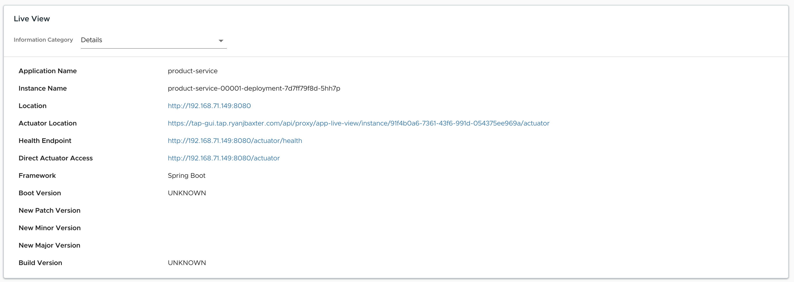

```terminal:interrupt
autostart: true
hidden: true
```

The API-first approach prioritizes the design and development of the application programming interface (API) before any other aspects of the application. 
This approach enables the consumers of an API to work more independently from its provider, and providers are able to facilitate discussions with stakeholders well before they might have coded themselves past the point of no return.

###### Discover API Documentation And More In Tanzu Developer Portal

Tanzu Developer Portal helps you to find documentation for APIs available in your organization and try them out before integrating them in your applications.

A core feature of Tanzu Developer Portal is the **Software Catalog**. The Software Catalog is a centralized system that keeps track of metadata for all the applications in your organization's ecosystem. The catalog is built around the concept of metadata YAML files stored together with the code, which are then harvested and visualized.
Here is an example of the YAML file from the product service.
```dashboard:reload-dashboard
name: GIT UI
url: {{ ingress_protocol }}://git-ui-{{ session_name }}.{{ ingress_domain }}?p=product-service.git;a=blob;f=catalog/component.yaml;hb=refs/heads/main
```
Let's open the Software Catalog.

```dashboard:open-url
url: https://tap-gui.{{ ENV_TAP_INGRESS }}/catalog
```


If you **switch the kind from "Component" to "System"** and select `sc-architecture-system` you can see lists of all the services, backing services, and also a graph visualizing their relationships.
```dashboard:open-url
url: https://tap-gui.{{ ENV_TAP_INGRESS }}/catalog/default/system/sc-architecture-system
```

In addition to a link to jump to the related source code, there is also one to access the **technical documentation**, which can be written in Markdown format in a source-code repository and displayed alongside the relevant catalog entries.
```dashboard:open-url
url: https://tap-gui.{{ ENV_TAP_INGRESS }}/docs/default/System/sc-architecture-system
```

APIs provided by the components can be discovered via the **API documentation plug-in**. Navigate back to the system view by clicking on the action, and **click on the only item's name in the APIs section**. If you **then switch from the Overview to the Definition tab**, you get a swagger-like experience to discover APIs like in the picture below.
```dashboard:open-url
url: https://tap-gui.{{ ENV_TAP_INGRESS }}/catalog/default/system/sc-architecture-system
```

With a feature called **API Auto Registration**, TAP can automatically register your APIs in Tanzu Developer Portal.

The configuration of the API Auto Registration requires an OpenAPI Specification (OAS), which can be autogenerated in Spring Boot applications with the [springdoc-openapi](https://springdoc.org) Java library.

We only have to add the library to our project's `pom.xml`, and no additional configuration is needed to expose the API documentation at the following path in JSON format: `/v3/api-docs`.
```editor:insert-lines-before-line
file: ~/product-service/pom.xml
line: 19
text: |2
          <springdoc.version>2.2.0</springdoc.version>
cascade: true
```
```editor:insert-lines-before-line
file: ~/product-service/pom.xml
line: 33
text: |2
          <dependency>
            <groupId>org.springdoc</groupId>
            <artifactId>springdoc-openapi-starter-webmvc-api</artifactId>
            <version>{springdoc.version}</version>
          </dependency>
```
As this library is not managed by the [standard BOM (Bills of Materials)](https://github.com/spring-projects/spring-boot/blob/main/spring-boot-project/spring-boot-dependencies/build.gradle) included in the `spring-boot-starter-parent` project, we have to specify a version.

After committing our code changes, we can configure the API Auto Registration in the Workload.
```editor:insert-value-into-yaml
file: ~/product-service/config/workload.yaml
path: spec.params
value:
  - name: api_descriptor
    value:
      type: openapi
      location:
        path: "/v3/api-docs"
      system: sc-architecture-system
      owner: team-vmware-tanzu-se
      description: "An API to manage products within the Spring Cloud Architecture app."
cascade: true
```
```terminal:execute
command: |
  kubectl apply -f ~/product-service/config/workload.yaml
clear: true
```

From the different components in the Software Catalog, you can also jump to the **Runtime Resources** view and have a closer look at the resources running on Kubernetes for your applications. Click the link below to see the workloads for the product service.
```dashboard:open-url
url: https://tap-gui.{{ ENV_TAP_INGRESS }}/catalog/default/component/product-service/workloads
```

If you select a Pod, you're able to see the logs and information provided by **App Live View**.




###### API Gateway

With so many APIs in a microservices application, developers need an API Gateway that they can control!

**VMware Spring Cloud Gateway for Kubernetes** is an **API gateway created for developers** based on the open-source [Spring Cloud Gateway](https://spring.io/projects/spring-cloud-gateway), along with integrating other Spring ecosystem projects such as Spring Security, Spring Session, and more. It automates the deployment of an API gateway service via the [Kubernetes Operator](https://kubernetes.io/docs/concepts/extend-kubernetes/operator/) pattern, and includes several other [commercial features](https://docs.vmware.com/en/VMware-Spring-Cloud-Gateway-for-Kubernetes/2.0/scg-k8s/GUID-index.html#key-features) like simple Single Sign-On (SSO) configuration and OpenAPI version 3 documentation auto-generation.


Let's create an instance of Spring Cloud Gateway for our application.

First, we have to configure a gateway instance via the `SpringCloudGateway` Kubernetes custom resource.
```editor:append-lines-to-file
file: ~/config/gateway/gateway.yaml
description: Create SpringCloudGateway resource configuration
text: |
  apiVersion: "tanzu.vmware.com/v1"
  kind: SpringCloudGateway
  metadata:
    name: api-gateway-1
  spec:
    api:
      serverUrl: https://gateway-{{ session_namespace }}.{{ ENV_TAP_INGRESS }}
    observability:
      tracing:
        zipkin:
          enabled: true
          url: http://zipkin:9411/api/v2/spans
    java-opts: "-Dmanagement.tracing.propagation.type=w3c -Dmanagement.tracing.sampling.probability=1.0 -Dspring.codec.max-in-memory-size=-1" # Required for a later applied response body filter
```

In the commercial version of Spring Cloud Gateway we define routes in a Kubernetes resource called `SpringCloudGatewayRouteConfig`.  
Let's define routes for both the product and order services.

These routes are simple in that they just have a path predicate to define what path to the gateway will route the requests to the services and then uses a filter to strip those paths from the request before it's routed to the downstream services.

```editor:append-lines-to-file
file: ~/config/gateway/gateway-route-config.yaml
description: Create SpringCloudGatewayRouteConfig resource configuration
text: |
  apiVersion: "tanzu.vmware.com/v1"
  kind: SpringCloudGatewayRouteConfig
  metadata:
    name: supply-chain-app-route-config
  spec:
    routes:
    - uri: http://product-service.{{ session_namespace }}
      predicates:
      - Path=/services/product-service/**
      filters:
      - StripPrefix=2
    - uri: http://order-service.{{ session_namespace }}
      predicates:
      - Path=/services/order-service/**
      filters:
      - StripPrefix=2
```

The last step is to link our route configuration to the gateway instance with a custom resource named `SpringCloudGatewayMapping`. 

```editor:append-lines-to-file
file: ~/config/gateway/gateway-route-mapping.yaml
description: Create SpringCloudGatewayMapping resource configuration
text: |
  apiVersion: "tanzu.vmware.com/v1"
  kind: SpringCloudGatewayMapping
  metadata:
    name: supply-chain-app-routes
  spec:
    gatewayRef:
      name: api-gateway-1
    routeConfigRef:
      name: supply-chain-app-route-config
```

Let's apply everything to the cluster to create the gateway, route configuration, and then connect the two with the mapping.
```terminal:execute
command: kubectl apply -f ~/config/gateway/
clear: true
```

With the gateway as the single entry point to our application, we shouldn't need to expose the order and product service directly anymore. This can be done by setting the `networking.knative.dev/visibility: cluster-local` label on your Workloads. 

*Hint: Even if this also works with the default installation of TAP, for production, a second ingress controller has to be configured with service type ClusterIP and configured in Knative, so that the services are really not reachable from the outside.*

We can now validate whether our configuration works by sending a request through it to the order service. 
```terminal:execute
command: |
  curl -s -X POST -H "Content-Type: application/json" -d '{"productId":"1", "shippingAddress": "Stuttgart"}' https://gateway-{{ session_namespace }}.{{ ENV_TAP_INGRESS }}/services/order-service/api/v1/orders | jq .
clear: true
```
We can also use ZipKin UI to see the new request flow.
```dashboard:open-url
url: https://zipkin-{{ session_namespace }}.{{ ENV_TAP_INGRESS }}/?serviceName=api-gateway-1&annotationQuery=method%3DPOST&lookback=12h&endTs=1692042417857&limit=100
```


