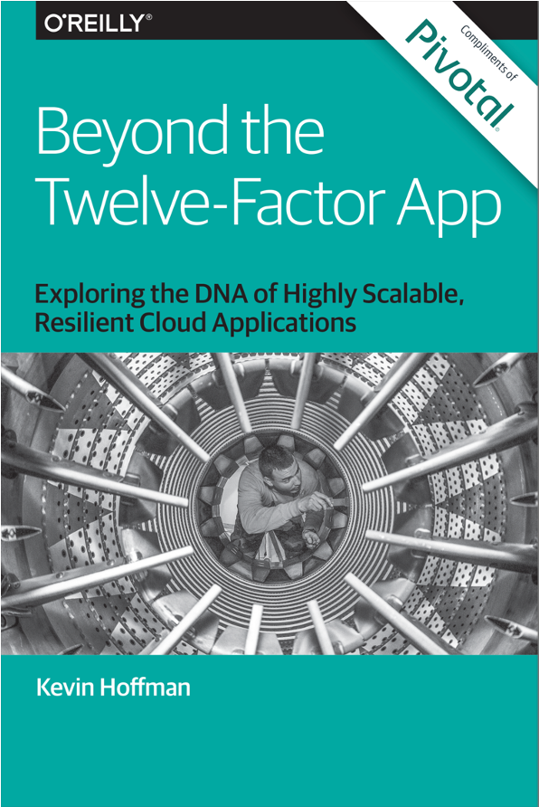
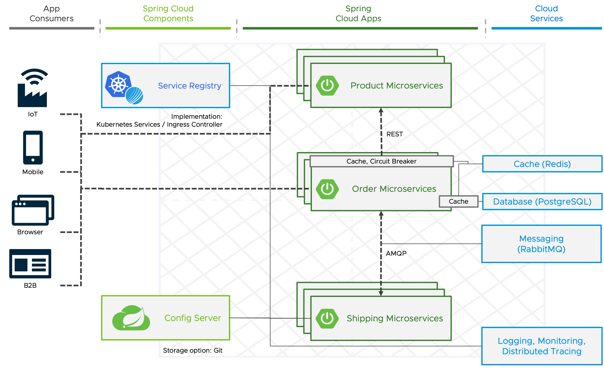
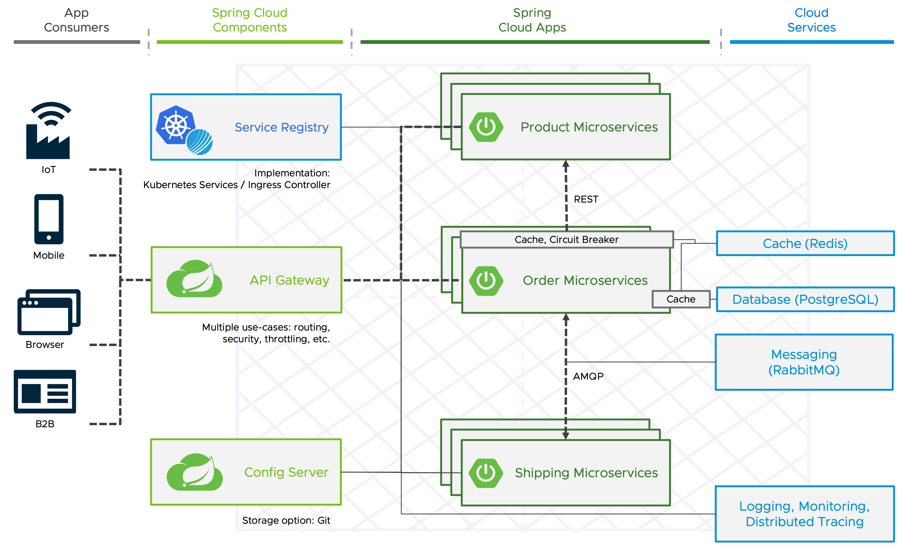
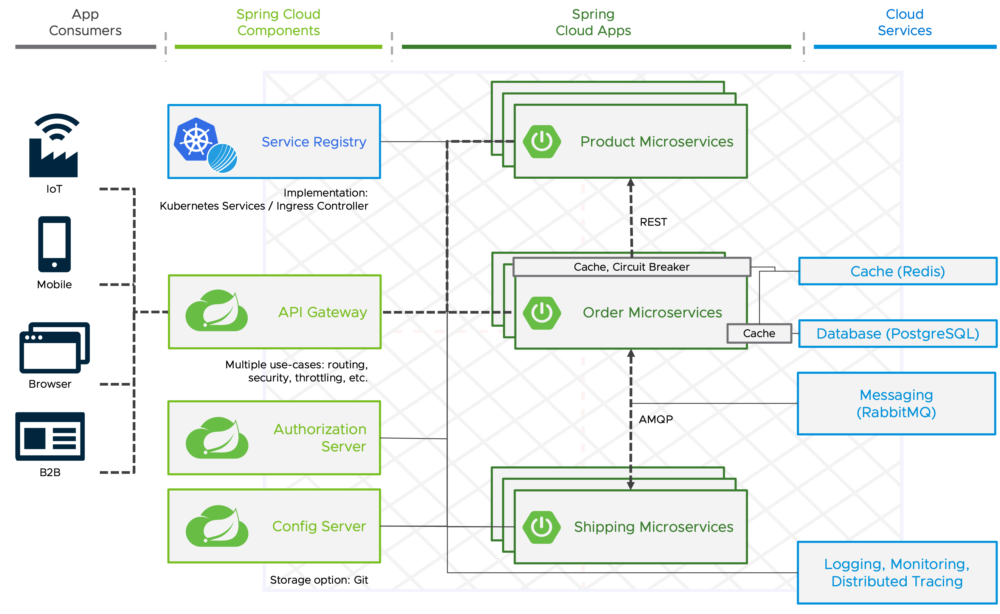

Technology has advanced since the original creation of the 12-factor App, and in some situations, it is necessary to elaborate on the initial guidelines as well as add new guidelines designed to meet modern standards for application development. 



In his book Beyond the Twelfe-Factor App, Kevin Hoffman presented a new set of guidelines that builds on the original 12 factor.

On of those is **Telemetry**.

##### Metrics

**TODO**

##### Distributed Tracing
With Distributed Tracing you can track user requests end-to-end across microservices architectures. 
**Spring Boot Actuator provides dependency management and auto-configuration for [Micrometer Tracing](https://micrometer.io/docs/tracing)**, a facade for popular tracer libraries.

Spring Boot ships auto-configuration for the following tracers:
- OpenTelemetry with Zipkin, Wavefront, or OTLP
- OpenZipkin Brave with Zipkin or Wavefront

Wavefront is now known as **Aria Operations for Applications**, our full-stack observability solution from infrastructure to applications.

For this workshop we use Zipkin as our trace backend to collect and visualize the traces.
**TODO: Use Crossplane and remove RBAC from workshop-template.yaml**
```terminal:execute
command: |
  cat <<EOF | kubectl apply -f -
  apiVersion: apps/v1
  kind: Deployment
  metadata:
    name: zipkin
  spec:
    selector:
      matchLabels:
        app: zipkin
    template:
      metadata:
        labels:
          app: zipkin
      spec:
        containers:
        - image: openzipkin/zipkin
          name: zipkin
          ports:
          - containerPort: 9411
            protocol: TCP
  --- 
  apiVersion: v1
  kind: Service
  metadata:
    name: zipkin
  spec:
    selector:
      app: zipkin
    ports:
    - name: http
      port: 9411
      protocol: TCP
      targetPort: 9411
  ---
  apiVersion: projectcontour.io/v1
  kind: HTTPProxy
  metadata:
    name: zipkin
  spec:
    routes:
    - conditions:
      - prefix: /
      services:
      - name: zipkin
        port: 9411
    virtualhost:
      fqdn: zipkin-{{ session_namespace }}.{{ ENV_TAP_INGRESS }}
  ---
  apiVersion: v1
  kind: Secret
  metadata:
    name: zipkin-binding-compatible
  type: servicebinding.io/zipkin
  stringData:
    type: zipkin
    provider: open-source
    url: http://zipkin-{{ session_namespace }}.{{ ENV_TAP_INGRESS }}
  ---
  apiVersion: services.apps.tanzu.vmware.com/v1alpha1
  kind: ResourceClaim
  metadata:
    name: zipkin-1
  spec:
    ref:
      apiVersion: v1
      kind: Secret
      name: zipkin-binding-compatible
  EOF
clear: true
```

In addition to the `org.springframework.boot:spring-boot-starter-actuator` dependency, we have to add a library that bridges the Micrometer Observation API to either OpenTelemetry or Brave and one that reports traces to the selected solution.

For our example, let's use **OpenTelemetry with Zikin**.

```editor:insert-lines-before-line
file: ~/product-service/pom.xml
line: 33
text: |2
          <dependency>
            <groupId>io.micrometer</groupId>
          <artifactId>micrometer-tracing-bridge-otel</artifactId>
          </dependency>
          <dependency>
            <groupId>io.opentelemetry</groupId>
            <artifactId>opentelemetry-exporter-zipkin</artifactId>
          </dependency>
```


To automatically propagate traces over the network, use the auto-configured `RestTemplateBuilder` or `WebClient.Builder` to construct the client.

By default, Spring Boot samples only 10% of requests to prevent overwhelming the trace backend. Let's set it to 100% for our demo so that every request is sent to the trace backend.
```editor:append-lines-to-file
file: ~/product-service/src/main/resources/application.yml
text: |
  management.tracing.sampling.probability: 1.0
```

To configure reporting to Zipkin we can use the `management.zipkin.tracing.*` configuration properties.
In our case, we would like to **set the required configuration automatically via a ServiceBinding**. Unfortunately, the [spring-cloud-bindings](https://github.com/spring-cloud/spring-cloud-bindings) library, which will be automatically added by the Spring Boot Buildpack, doesn't support it yet. 
But it's possible to add additional bindings by registering additional implementations of the `BindingsPropertiesProcessor`.
```editor:append-lines-to-file
file: ~/product-service/src/main/java/com/example/productservice/ZipkinBindingsPropertiesProcessor.java
text: |
  package com.example.productservice;

  import org.springframework.cloud.bindings.Bindings;
  import org.springframework.cloud.bindings.boot.BindingsPropertiesProcessor;
  import org.springframework.core.env.Environment;

  import java.util.List;
  import java.util.Map;
  public class ZipkinBindingsPropertiesProcessor implements BindingsPropertiesProcessor {
    public static final String TYPE = "zipkin";

    @Override
    public void process(Environment environment, Bindings bindings, Map<String, Object> properties) {
        bindings.filterBindings(TYPE).forEach(binding -> {
            properties.putIfAbsent("management.zipkin.tracing.endpoint", binding.getSecret().get("url") + ":9411/api/v2/spans");
        });
    }
  } 
```
You must also add an entry in `META_INF/spring.factories` so that the custom processor can be discovered.
```editor:append-lines-to-file
file: ~/product-service/src/main/resources/META-INF/spring.factories
text: |
  org.springframework.cloud.bindings.boot.BindingsPropertiesProcessor=\
  com.example.productservice.ZipkinBindingsPropertiesProcessor
```

Last but not least, the service binding has to be configured in the Workload and the changes pushed to Git and applied to the environment.
```editor:insert-value-into-yaml
file: ~/product-service/config/workload.yaml
path: spec.serviceClaims
value:
  - name: tracing
    ref:
      apiVersion: services.apps.tanzu.vmware.com/v1alpha1
      kind: ResourceClaim
      name: zipkin-1
``` 
As soon as our outdated application and service binding is applied ...
```dashboard:open-url
url: https://tap-gui.{{ ENV_TAP_INGRESS }}/supply-chain/host/{{ session_namespace }}/product-service
```
... we can send a request to the order service, and have a look at the ZipKin UI to view the traces.
```terminal:execute
command: curl -X POST -H "Content-Type: application/json" -d '{"productId":"1", "shippingAddress": "Stuttgart"}' https://order-service-{{ session_namespace }}.{{ ENV_TAP_INGRESS }}/api/v1/orders
clear: true
```

```dashboard:open-url
url: http://zipkin-{{ session_namespace }}.{{ ENV_TAP_INGRESS }}
```



##### Factor: API first

**TODO** TAP GUI Docs and API plugin

###### API Gateway

By designing your API first, you are able to facilitate discussion with your stakeholders (your internal team, customers, or possibly other teams within your organization who want to consume your API) well before you might have coded yourself past the point of no return. 

With so many APIs in a microservices application, developers need an API Gateway that they can control!

[Spring Cloud Gateway](https://spring.io/projects/spring-cloud-gateway) aims to provide a simple and effective way to route to APIs and provides  features related to security and resiliency to them.

Based on the open source Spring Cloud Gateway project, our commercial offering **VMware Spring Cloud Gateway for Kubernetes** provides additional functionalities like a Kubernetes "native" experience, simple single sign-On (SSO) configuration, and OpenAPI auto-generation for documentation. 

Let‘s have a look how you can deploy and configure a gateway for your microservices application with TAP and the included VMware Spring Cloud Gateway for Kubernetes.

**TODO: Provisioning via Crossplane + provide Config, (Optional) Change Endpoints to internal**



##### Authentication and Authorization

Security is a vital part of any application and cloud environment!
OAuth 2 is an authorization framework granting clients access to protected resources via an authorization server.
To make the application secure, you can simply add Spring Security as a dependency. By adding the Spring Security OAuth 2 Client, it will secure your app with OAuth 2 by default.
Spring Authorization Server delivers OAuth 2 Authorization Server support to the Spring community.



##### Spring Cloud Stream & Function + TAP FaaS experience


