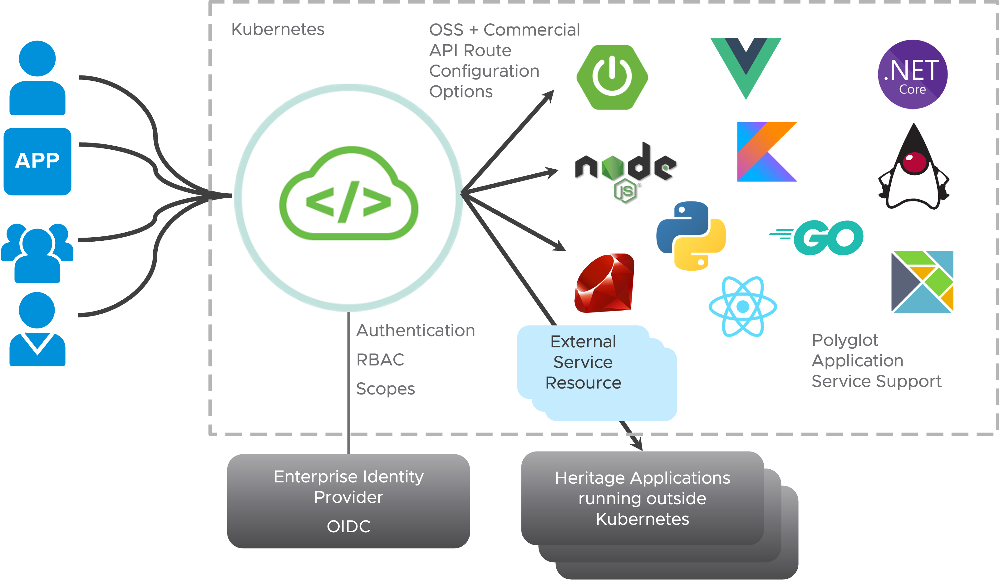

Technology has advanced since the original creation of the 12-factor app, and in some situations, it is necessary to elaborate on the initial guidelines as well as add new guidelines designed to meet modern standards for application development. 


In his book Beyond the **Twelfe-Factor App**, Kevin Hoffman presented a new set of guidelines that build on the original 12 factors. The book can be downloaded [here](https://tanzu.vmware.com/content/ebooks/beyond-the-12-factor-app).

One of those is **Telemetry**.

##### Distributed Tracing
With Distributed Tracing, you can track user requests end-to-end across microservices architectures. 
**Spring Boot Actuator provides dependency management and auto-configuration for [Micrometer Tracing](https://micrometer.io/docs/tracing)**, a facade for popular tracer libraries.

Spring Boot ships auto-configuration for the following tracers:
- OpenTelemetry with Zipkin, Wavefront, or OTLP
- OpenZipkin Brave with Zipkin or Wavefront

Wavefront is now known as **Aria Operations for Applications**, our full-stack observability solution from infrastructure to applications.

For this workshop, you will use Zipkin as our trace backend to collect and visualize the traces, already running in the cluster.

In addition to the `org.springframework.boot:spring-boot-starter-actuator` dependency, we have to add a library that bridges the Micrometer Observation API to either OpenTelemetry or Brave and one that reports traces to the selected solution.

For our example, let's use **OpenTelemetry with Zikin**.

```editor:insert-lines-before-line
file: ~/product-service/pom.xml
line: 33
text: |2
          <dependency>
            <groupId>io.micrometer</groupId>
            <artifactId>micrometer-tracing-bridge-otel</artifactId>
          </dependency>
          <dependency>
            <groupId>io.opentelemetry</groupId>
            <artifactId>opentelemetry-exporter-zipkin</artifactId>
          </dependency>
```

To automatically propagate traces over the network, use the auto-configured `RestTemplateBuilder` or `WebClient.Builder` to construct the client.

By default, Spring Boot samples only 10% of requests to prevent overwhelming the tracing backend. Let's set it to 100% for our demo so that every request is sent to the tracing backend.
```editor:append-lines-to-file
file: ~/product-service/src/main/resources/application.yaml
text: |
  management:
    tracing.sampling.probability: 1.0
```

To configure reporting to Zipkin we can use the `management.zipkin.tracing.*` configuration properties.
In our case, we would like to **set the required configuration automatically via a ServiceBinding**. Unfortunately, the [spring-cloud-bindings](https://github.com/spring-cloud/spring-cloud-bindings) library, which will be automatically added by the Spring Boot Buildpack, doesn't support it yet. 
But it's possible to add additional bindings by registering additional implementations of the `BindingsPropertiesProcessor`.
```editor:append-lines-to-file
file: ~/product-service/src/main/java/com/example/productservice/ZipkinBindingsPropertiesProcessor.java
text: |
  package com.example.productservice;

  import org.springframework.cloud.bindings.Bindings;
  import org.springframework.cloud.bindings.boot.BindingsPropertiesProcessor;
  import org.springframework.core.env.Environment;

  import java.util.Map;
  public class ZipkinBindingsPropertiesProcessor implements BindingsPropertiesProcessor {
    public static final String TYPE = "zipkin";

    @Override
    public void process(Environment environment, Bindings bindings, Map<String, Object> properties) {
        bindings.filterBindings(TYPE).forEach(binding -> {
            properties.putIfAbsent("management.zipkin.tracing.endpoint", binding.getSecret().get("uri") + "/api/v2/spans");
        });
    }
  } 
```
```editor:insert-lines-before-line
file: ~/product-service/pom.xml
line: 33
text: |2
          <dependency>
            <groupId>org.springframework.cloud</groupId>
            <artifactId>spring-cloud-bindings</artifactId>
            <version>2.0.1</version>
          </dependency>
```
You must also add an entry in `META_INF/spring.factories` so that the custom processor can be discovered.
```terminal:execute
command: mkdir ~/product-service/src/main/resources/META-INF
clear: true
```
```editor:append-lines-to-file
file: ~/product-service/src/main/resources/META-INF/spring.factories
text: |
  org.springframework.cloud.bindings.boot.BindingsPropertiesProcessor=\
    com.example.productservice.ZipkinBindingsPropertiesProcessor
```

Last but not least, the service binding has to be configured in the Workload and the changes pushed to Git and applied to the environment.
```editor:insert-value-into-yaml
file: ~/product-service/config/workload.yaml
path: spec.serviceClaims
value:
  - name: tracing
    ref:
      apiVersion: services.apps.tanzu.vmware.com/v1alpha1
      kind: ResourceClaim
      name: zipkin-1
``` 

Let's commit the updated source code and wait until the deployment is updated.
```terminal:execute
command: |
  cd product-service && git add . && git commit -m "Add external configuration support" && git push
  cd ..
clear: true
```
```terminal:execute
command: tanzu apps workload apply -f product-service/config/workload.yaml -y
clear: true
```

As soon as our outdated application and service binding is applied ...
```dashboard:open-url
url: https://tap-gui.{{ ENV_TAP_INGRESS }}/supply-chain/host/{{ session_namespace }}/product-service
```
... we can send a request to the order service, and have a look at the ZipKin UI to view the traces.
```terminal:execute
command: |
  curl -X POST -H "Content-Type: application/json" -d '{"productId":"1", "shippingAddress": "Stuttgart"}' https://order-service-{{ session_namespace }}.{{ ENV_TAP_INGRESS }}/api/v1/orders
clear: true
```

```dashboard:open-url
url: https://zipkin-{{ session_namespace }}.{{ ENV_TAP_INGRESS }}
```


##### Factor: API first

The API-first approach prioritizes the design and development of the application programming interface (API) before any other aspects of the application. 
This approach enables for example the consumers of an API to work more independently from its provider, and providers are able to facilitate discussions with stakeholders well before they might have coded themselves past the point of no return.

###### Discover API documentation and more in Tanzu Developer Portal

Tanzu Developer Portal helps you to find documentation for APIs available in your organization and try them out before integrating them in your applications.

A core feature of Tanzu Developer Portal and the Cloud Native Computing Foundation’s project [Backstage](https://backstage.io), on which it's based on, is the **Software Catalog**. A centralized system that keeps track of ownership and metadata for all the applications in your organization's ecosystem. The catalog is built around the concept of metadata YAML files stored together with the code, which are then harvested and visualized.
```dashboard:open-url
url: {{ ENV_GITEA_BASE_URL }}/product-service/catalog/component.yaml
```
```dashboard:open-url
url: https://tap-gui.{{ ENV_TAP_INGRESS }}/catalog
```

If you **switch the kind from "Component" to "System"** and select `sc-architecture-system` you can see lists of all the services, backing services, and also a graph visualizing their relationships defined by metadata YAML files.
```dashboard:open-url
url: https://tap-gui.{{ ENV_TAP_INGRESS }}/catalog/default/system/sc-architecture-system
```
In addition to a link to jump to the related source code, there is also one to access the **technical documentation** which can be written in Markdown format in a source-code repository and displayed alongside the relevant catalog entries.
```dashboard:open-url
url: https://tap-gui.{{ ENV_TAP_INGRESS }}/docs/default/System/sc-architecture-system
```

APIs provided by the components can be discovered via the **API documentation plug-in**. 
```dashboard:open-url
url: https://tap-gui.{{ ENV_TAP_INGRESS }}/catalog/default/api/gateway-{{ ENV_TAP_INGRESS }}/definition
```
With a feature called **API Auto Registration**, TAP can automatically register your APIs in Tanzu Developer Portal.

From the different components in the Software Catalog, you can also jump to the **Runtime Resources** view and have a closer look at the resources running on Kubernetes for your applications. If you select a Pod you're able to see the logs, and if it's running one of our services, also information provided by **App Live View**.
```dashboard:open-url
url: https://tap-gui.{{ ENV_TAP_INGRESS }}/catalog/default/component/product-service/workloads
```

###### API Gateway

With so many APIs in a microservices application, developers need an API Gateway that they can control!

[Spring Cloud Gateway](https://spring.io/projects/spring-cloud-gateway) is a **library that can be used to create an API gateway** to expose endpoints for application services written in any programming language.
It aims to provide a simple and effective way to route to APIs and provides features related to security and resiliency to them.

The best way to create a gateway for your microservices application with Spring Cloud Gateway from scratch is to go to [start.spring.io](https://start.spring.io), add the `spring-cloud-starter-gateway` dependency, and additional dependencies based on your needs for security, distributed tracing, externalized configuration etc.

The main building blocks of Spring Cloud Gateway are: 
- **Routes**: Defined by an ID, a destination URI, a collection of predicates, and a collection of filters.
- **Predicates**: Used for matching on anything from the HTTP request, such as headers or parameters.
- **Filters**: Used for modifications of requests and responses before or after sending the downstream request
Spring Cloud Gateway already provides Predicates and Filters for most of the common use cases, but it's also [possible to build your own](https://docs.spring.io/spring-cloud-gateway/docs/current/reference/html/#developer-guide).

Routes can be configured in a number of ways, like via the Java API provided by the Gateway, or configuration properties stored in a Git repository.

**VMware Spring Cloud Gateway for Kubernetes** is an **API gateway created for developers** based on the open-source Spring Cloud Gateway project, along with integrating other Spring ecosystem projects such as Spring Security, Spring Session, and more. It automates the deployment of an API gateway service via the [Kubernetes Operator](https://kubernetes.io/docs/concepts/extend-kubernetes/operator/) pattern, and includes several other [commercial features](https://docs.vmware.com/en/VMware-Spring-Cloud-Gateway-for-Kubernetes/2.0/scg-k8s/GUID-index.html#key-features) like simple Single Sign-On (SSO) configuration, and OpenAPI version 3 documentation auto-generation.



First, we have to configure a gateway instance via the `SpringCloudGateway` Kubernetes custom resource.
```terminal:execute
command: |
  cat <<EOF | kubectl apply -f -
  apiVersion: "tanzu.vmware.com/v1"
  kind: SpringCloudGateway
  metadata:
    name: api-gateway-1
  spec:
    api:
      serverUrl: https://gateway-{{ session_namespace }}.{{ ENV_TAP_INGRESS }}
    observability:
      tracing:
        zipkin:
          enabled: true
          url: http://zipkin:9411/api/v2/spans
  EOF
clear: true
```

Now it's time to define our route configuration with a `SpringCloudGatewayRouteConfig` custom resource.
```terminal:execute
command: |
  cat <<EOF | kubectl apply -f -
  apiVersion: "tanzu.vmware.com/v1"
  kind: SpringCloudGatewayRouteConfig
  metadata:
    name: supply-chain-app-route-config
  spec:
    routes:
    - uri: http://product-service.{{ session_namespace }}
      predicates:
      - Path=/services/product-service/**
      filters:
      - StripPrefix=2
    - uri: http://order-service.{{ session_namespace }}
      predicates:
      - Path=/services/order-service/**
      filters:
      - StripPrefix=2
  EOF
clear: true
```

The last step is to link our route configuration to the gateway instance with a `SpringCloudGatewayMapping` custom resource, which allows using a route configuration with multiple gateway instances.
```terminal:execute
command: |
  cat <<EOF | kubectl apply -f -
  apiVersion: "tanzu.vmware.com/v1"
  kind: SpringCloudGatewayMapping
  metadata:
    name: supply-chain-app-routes
  spec:
    gatewayRef:
      name: api-gateway-1
    routeConfigRef:
      name: supply-chain-app-route-config
  EOF
clear: true
```

Having the gateway as the single entry point to our application, we shouldn't expose the order and product service directly anymore. This can be done by setting the `networking.knative.dev/visibility: cluster-local` label on your Workloads. 

*Hint: Even if this also works with the default installation of TAP, for production a second ingress controller has to be configured with service type ClusterIP and configured in Knative, so that the services are really not reachable from the outside.*

We can now validate whether our configuration works by sending a request through it to the order service. 
```terminal:execute
command: |
  curl -X POST -H "Content-Type: application/json" -d '{"productId":"1", "shippingAddress": "Stuttgart"}' https://gateway-{{ session_namespace }}.{{ ENV_TAP_INGRESS }}/services/order-service/api/v1/orders
clear: true
```
We can also use ZipKin UI to see the new request flow.
```dashboard:open-url
url: https://zipkin-{{ session_namespace }}.{{ ENV_TAP_INGRESS }}
```


##### Authentication and Authorization

Security is a vital part of any application and cloud environment!
**OAuth 2 is an authorization framework** granting clients access to protected resources via an authorization server.
To make the application secure, you can simply add Spring Security as a dependency. **By adding the Spring Security OAuth 2 Client, it will secure your app with OAuth 2** by default.

**Spring Authorization Server delivers OAuth 2 Authorization Server** support to the Spring community.

**Application Single Sign-On for VMware Tanzu** (commonly called AppSSO) is based on the Spring Authorization Server project provides APIs for curating and consuming a "Single Sign-On as a service" offering on Tanzu Application Platform. 

The first step is to create an Authorization Server along with an RSAKey key for signing tokens. This AuthServer example uses an unsafe testing-only identity provider which should never be used in production environments! Information on how to configure external identity providers is available [here](https://docs.vmware.com/en/VMware-Tanzu-Application-Platform/1.6/tap/app-sso-how-to-guides-service-operators-identity-providers.html).
```terminal:execute
command: |
  cat <<EOF | kubectl apply -f -
  apiVersion: "sso.apps.tanzu.vmware.com/v1alpha1"
  kind: AuthServer
  metadata:
    name: authserver-1
    labels:
      name: authserver-1
    annotations:
      sso.apps.tanzu.vmware.com/allow-client-namespaces: "{{ session_namespace }}"
      sso.apps.tanzu.vmware.com/allow-unsafe-issuer-uri: ""
      sso.apps.tanzu.vmware.com/allow-unsafe-identity-provider: ""
  spec:
    replicas: 1
    tls:
      deactivated: true
    identityProviders:
      - name: "internal"
        internalUnsafe:
          users:
            - username: "developer"
              password: "123456"
              email: "developer@example.com"
              emailVerified: true
              roles:
                - "user"
    tokenSignature:
      signAndVerifyKeyRef:
        name: "authserver-signing-key"
  ---
  apiVersion: secretgen.k14s.io/v1alpha1
  kind: RSAKey
  metadata:
    name: authserver-signing-key
  spec:
    secretTemplate:
      type: Opaque
      stringData:
        key.pem: \$(privateKey)
        pub.pem: \$(publicKey)
  EOF
clear: true
```

The `metadata.labels` uniquely identify the AuthServer. They are used as selectors by `ClientRegistration`s, to declare from which authorization server a specific client obtains tokens.

The `sso.apps.tanzu.vmware.com/allow-client-namespaces` annotation restricts the namespaces in which you can create ClientRegistrations targeting this authorization server

The `tokenSignature` references a private RSA key used to sign ID Tokens, using JSON Web Signatures, and clients use the public key to verify the provenance and integrity of the ID tokens. 

```terminal:execute
command: |
  cat <<EOF | kubectl apply -f -
  apiVersion: sso.apps.tanzu.vmware.com/v1alpha1
  kind: ClientRegistration
  metadata:
    name: client-registration
  spec:
    authServerSelector:
      matchLabels:
        name: authserver-1
    redirectURIs:
    -  https://gateway-{{ session_namespace }}.{{ ENV_TAP_INGRESS }}/frontend/index.html"
    clientAuthenticationMethod: none
    authorizationGrantTypes:
      - "client_credentials"
      - "authorization_code"
      - "refresh_token"
    scopes:
    - name: openid
    - name: offline_access
    - name: email
    - name: profile
    - name: roles
  EOF
clear: true
```
With the `authServerSelector`, a `ClientRegistration` must uniquely identify an AuthServer. 
The Redirect URLs defined in `redirectURIs` are a critical part of the OAuth flow. They define where the authorization server will redirect the user after successfully authorizing an application.

For this workshop, the redirect URL is targeting a **single-page app acting as an OAuth client** (which is already deployed for you).
After the single-page app has obtained an access token, it will send it in the HTTP Authorization header 
of the requests to our services (known as resource servers in OAuth), which can then verify it to determine whether to process the request, find the associated user account, etc.

Public clients like a single-page or mobile app don't require credentials to obtain tokens and instead rely on the Proof Key for Code Exchange (PKCE) Authorization Code flow extension, which is the reason why `clientAuthenticationMethod` is set to `none`.

After applying our ClientRegistration to the cluster, **AppSSO will create a secret containing the credentials that client applications will use**, named after the client registration.

 ```editor:insert-lines-before-line
file: ~/product-service/pom.xml
line: 33
text: |2
  		<dependency>
        <groupId>org.springframework.boot</groupId>
        <artifactId>spring-boot-starter-oauth2-resource-server</artifactId>
      </dependency>
```

 ```editor:insert-lines-before-line
file: ~/product-service/pom.xml
line: 14
text: |2
              .requestMatchers("/api/**").authenticated()
```

 ```editor:insert-lines-before-line
file: ~/product-service/pom.xml
line: 17
text: |2
              .oauth2ResourceServer((oauth2) -> oauth2.jwt(Customizer.withDefaults()));
```

```editor:insert-value-into-yaml
file: ~/product-service/src/main/resources/application.yaml
path: spring
value:
  security.oauth2.resourceserver.jwt.jwk-set-uri: ${spring.security.oauth2.client.provider.appsso.issuer-uri}/oauth2/jwks
```

By configuring a service binding in the Workload, we don't have to care about additional configuration.
```editor:insert-value-into-yaml
file: ~/product-service/config/workload.yaml
path: spec.serviceClaims
value:
  - name: auth-client
    ref:
      apiVersion: services.apps.tanzu.vmware.com/v1alpha1
      kind: ResourceClaim
      name: auth-client
```   


**TODO Add frontend**
Now it's finally time to see whether everything works as expected with the **username: `developer`**, and the **password: `123456`** as defined in the `AuthServer`.
```dashboard:open-url
url: https://gateway-{{ session_namespace }}.{{ ENV_TAP_INGRESS }}/frontend/
```


##### Spring Cloud Stream & Function + TAP FaaS experience
