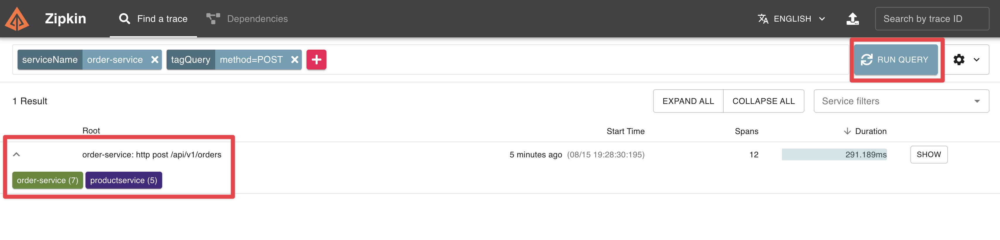

```terminal:interrupt
autostart: true
hidden: true
cascade: true
```
```terminal:execute
command: |
  (cd ~/shipping-service && [ "$(git rev-parse --is-inside-work-tree 2>/dev/null)" != "true" ] && git init -b main && git remote add origin $GIT_PROTOCOL://$GIT_HOST/shipping-service.git && git add . && git commit -m "Initial implementation" && git push -u origin main && tanzu apps workload apply -f config/workload.yaml -y)
  clear
hidden: true
```

Technology has advanced since the original creation of the 12-factor app, and in some situations, it is necessary to elaborate on the initial guidelines as well as add new guidelines designed to meet modern standards for application development. 


In his book Beyond the **Twelfe-Factor App**, Kevin Hoffman presented a new set of guidelines that build on the original 12 factors. The book can be downloaded [here](https://tanzu.vmware.com/content/ebooks/beyond-the-12-factor-app).

One of those is **Telemetry**.

##### Distributed Tracing
With Distributed Tracing, you can track user requests end-to-end across microservices architectures. 
**Spring Boot Actuator provides dependency management and auto-configuration for [Micrometer Tracing](https://micrometer.io/docs/tracing)**, a facade for popular tracer libraries.

Spring Boot ships auto-configuration for the following tracers:
- OpenTelemetry with Zipkin, Wavefront, or OTLP
- OpenZipkin Brave with Zipkin or Wavefront

Wavefront is now known as **Aria Operations for Applications**, VMware's full-stack observability solution from infrastructure to applications.

For this workshop, you will use Zipkin as our trace backend to collect and visualize the traces already running in the cluster.

In addition to the `org.springframework.boot:spring-boot-starter-actuator` dependency, we have to add a library that bridges the Micrometer Observation API to either OpenTelemetry or Brave and one that reports traces to the selected solution.

For our example, let's use **OpenTelemetry with Zikin**.

```editor:insert-lines-before-line
file: ~/product-service/pom.xml
line: 33
text: |2
          <dependency>
            <groupId>io.micrometer</groupId>
            <artifactId>micrometer-tracing-bridge-otel</artifactId>
          </dependency>
          <dependency>
            <groupId>io.opentelemetry</groupId>
            <artifactId>opentelemetry-exporter-zipkin</artifactId>
          </dependency>
```

To automatically propagate traces over the network, use the auto-configured `RestTemplateBuilder` or `WebClient.Builder` to construct the client.

By default, Spring Boot samples only 10% of requests to prevent overwhelming the tracing backend. Let's set it to 100% for our demo so that every request is sent to the tracing backend.
```editor:append-lines-to-file
file: ~/product-service/src/main/resources/application.yaml
text: |
  management:
    tracing.sampling.probability: 1.0
```

To configure reporting to Zipkin we can use the `management.zipkin.tracing.*` configuration properties.
Normally when using an external service like Zipkin we would expect to find to that service using service bindings as we did with PostreSQL, Redis, and RabbitMQ in the order service. Unfortunately, [spring-cloud-bindings](https://github.com/spring-cloud/spring-cloud-bindings), which will be automatically added by the Spring Boot Buildpack when an app is deployed to TAP, doesn't support Zipkin yet. 

To work around this, we can add additional bindings by creating our own `BindingsPropertiesProcessor` for Zipkin.

First, we must add the `spring-cloud-bindings` dependency to our classpath.

```editor:insert-lines-before-line
file: ~/product-service/pom.xml
line: 33
text: |2
          <dependency>
            <groupId>org.springframework.cloud</groupId>
            <artifactId>spring-cloud-bindings</artifactId>
            <version>2.0.1</version>
          </dependency>
```

Now we can create a new class called `ZipkinBindingsPropertiesProcessor` which implements `BindingsPropertiesProcessor`.

```editor:append-lines-to-file
file: ~/product-service/src/main/java/com/example/productservice/ZipkinBindingsPropertiesProcessor.java
description: Create ZipkinBindingsPropertiesProcessor
text: |
  package com.example.productservice;

  import org.springframework.cloud.bindings.Bindings;
  import org.springframework.cloud.bindings.boot.BindingsPropertiesProcessor;
  import org.springframework.core.env.Environment;

  import java.util.Map;
  public class ZipkinBindingsPropertiesProcessor implements BindingsPropertiesProcessor {
    public static final String TYPE = "zipkin";

    @Override
    public void process(Environment environment, Bindings bindings, Map<String, Object> properties) {
        bindings.filterBindings(TYPE).forEach(binding -> {
            properties.putIfAbsent("management.zipkin.tracing.endpoint", binding.getSecret().get("uri") + "/api/v2/spans");
        });
    }
  } 
```
Finally, we must register our new `BindingsPropertiesProcessor` within `spring.factories` so it actually processes the bindings.

You must also add an entry in `META_INF/spring.factories` so that the custom processor can be discovered.
```terminal:execute
command: mkdir ~/product-service/src/main/resources/META-INF
clear: true
```
```editor:append-lines-to-file
file: ~/product-service/src/main/resources/META-INF/spring.factories
text: |
  org.springframework.cloud.bindings.boot.BindingsPropertiesProcessor=\
    com.example.productservice.ZipkinBindingsPropertiesProcessor
```

As we have already done with service bindings, we need to add a service claim to our workload.yaml for the Zipkin service.

```editor:insert-value-into-yaml
file: ~/product-service/config/workload.yaml
path: spec.serviceClaims
value:
  - name: tracing
    ref:
      apiVersion: services.apps.tanzu.vmware.com/v1alpha1
      kind: ResourceClaim
      name: zipkin-1
``` 

Let's commit the updated source code and wait until the deployment is updated.
```terminal:execute
command: |
  (cd product-service && git add . && git commit -m "Add external configuration support" && git push)
clear: true
```
```terminal:execute
command: tanzu apps workload apply -f product-service/config/workload.yaml -y
clear: true
```

As we have done before we can view the deployment of our application in Tanzu Developer Portal's supply chain view or by tailing the logs.
```dashboard:open-url
url: https://tap-gui.{{ ENV_TAP_INGRESS }}/supply-chain/host/{{ session_namespace }}/product-service
```

```terminal:execute
session: 2
command: |
  tanzu apps workload tail product-service --since 1h
clear: true
```
As the order service was already configured to send tracing data to Zipkin, we can now send a new order to it and see the tracing information of that request and the related ones the order service is for example sending to the product service in Zipkin.

```terminal:execute
command: |
  curl -s -X POST -H "Content-Type: application/json" -d '{"productId":"1", "shippingAddress": "Stuttgart"}' https://order-service-{{ session_namespace }}.{{ ENV_TAP_INGRESS }}/api/v1/orders | jq .
clear: true
```

Open the Zipkin UI using the URL below.  Once the Zipkin UI opens click the Run Query button and you should see at least 1 request in the query results.

```dashboard:open-url
url: https://zipkin-{{ session_namespace }}.{{ ENV_TAP_INGRESS }}/?serviceName=order-service&annotationQuery=method%3DPOST&lookback=12h&endTs=1692042417857&limit=100
```

There should be a request that took a bit longer to make, this request is the one that was made before we cached any data.



If you select Show on that trace you can see the tracing details of the request from the order service to the product service.


Let's interrupt the terminals before moving on.
```terminal:interrupt-all
```

Below is an updated diagram of our application architecture.


