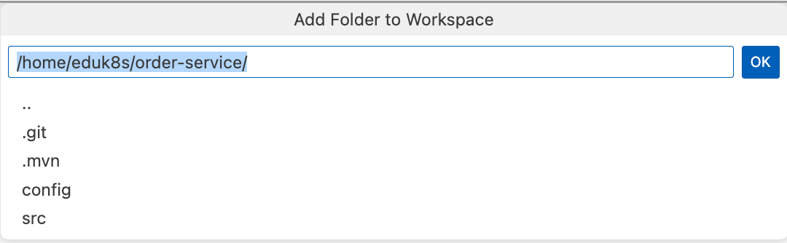

The **fourth and sixth factor** implies that any **data** that needs to be persisted must be **stored in a stateful backing service**, such as a database because the processes are stateless and share-nothing.
A backing service is any service that your application needs for its functionality. Examples of the different types of backing services are data stores, messaging systems, and also services that provide business functionality.

Those backing services are handled as attached resources in a 12-factor app which can be swapped without changing the application code in case of failures.

##### Provisioning and consumption of backing services

TAP makes it easy as possible to discover, curate, consume, and manage backing services, such as databases, queues, and caches, across single or multi-cluster environments. 

This experience is made possible by using the **Services Toolkit** component. 

To demonstrate how a Spring Boot app can use backing services on TAP lets use the order-service.


To modify the order service to use services on TAP lets first import it into our IDE's workshpace.

Open the Explorer view in the IDE.

```editor:execute-command
command: workbench.view.explorer
```
The order service is in the following directory, copy the path to your clipboard

```copy
/home/eduk8s/order-service/
```

Now we need to add the order service to our workspace.  Execute the command below.

```editor:execute-command
command: workbench.action.addRootFolder
```

In the "Add Folder To Workspace" popup paste the path to the order service project and click OK.




The **order service** uses a **PostgreSQL database** to store orders.  We have both `spring-boot-starter-data-jpa` and `postgresql` on the classpath.

```
		<dependency>
			<groupId>org.springframework.boot</groupId>
			<artifactId>spring-boot-starter-data-jpa</artifactId>
		</dependency>
		<dependency>
			<groupId>org.postgresql</groupId>
			<artifactId>postgresql</artifactId>
			<scope>runtime</scope>
		</dependency>
```


The order service saves and updates orders to the database within the `OrderApplicationService` class.

```editor:open-file
file: ~/order-service/src/main/java/com/example/orderservice/order/OrderApplicationService.java
line: 32
```

The order service also uses and **RabbitMQ** to asynchronously communicate with the **shipping service** and includess `spring-boot-starter-amqp` on the classpath.

```
		<dependency>
			<groupId>org.springframework.boot</groupId>
			<artifactId>spring-boot-starter-amqp</artifactId>
		</dependency>
```


The order service sends messages to the shipping service within the `ShippingService` using the `exchange` method.

```editor:open-file
file: ~/order-service/src/main/java/com/example/orderservice/order/ShippingService.java
line: 45
```

TAP provides developers a self-service model to provision backing services across for their applications.

In this workshop, we will run commands manually to dynamically provision a backing services for our application - in production environments, this should be automated.

Let's first discover available service classes in the cluster. 
```terminal:execute
command: tanzu service class list
clear: true
```
This should result in a list that looks similar to 

```
  NAME                  DESCRIPTION               
  kafka-unmanaged       Kafka by Bitnami          
  mongodb-unmanaged     MongoDB by Bitnami        
  mysql                 MySQL DB Instances        
  mysql-unmanaged       MySQL by Bitnami          
  postgresql-unmanaged  PostgreSQL by Bitnami     
  rabbitmq              It's a RabbitMQ cluster!  
  rabbitmq-unmanaged    RabbitMQ by Bitnami       
  redis-unmanaged       Redis by Bitnami
```


There are several [Bitnami](https://bitnami.com) Helm charts for data services available, which are pre-installed with TAP as examples. Those services can run everywhere where Crossplane supports the provisioning, e.g. in a Kubernetes cluster or native on a public cloud.

The service classes abstraction and Crossplane make it also possible to have a different way of provisioning services in different environments without changing the workload or resources generated by the supply chain. So a PostgreSQL database in test cluster could be dynamically provisioned as Helm Chart while in a production environment you could use a native AWS service. 

We can have a closer look at a service class in TAP to see available configuration options exposed by the platform operators by executing `tanzu servive class get`.

```terminal:execute
command: tanzu service class get postgresql-unmanaged
clear: true
```

Since the order service needs a PostgreSQL database lets claim the pre-installed Bitnami PostgreSQL service to obtain such a database.
```terminal:execute
command: tanzu service class-claim create postgres-1 --class postgresql-unmanaged --parameter storageGB=1
clear: true
```
It might take a moment or two before the claim reports `Ready: True`. After the claim is ready, you then have a successful claim for a PostgreSQL database.
We can check whether the claim is ready by executing the following command.  The `status.Ready` value should be `True`.

```terminal:execute
command: tanzu services class-claims get postgres-1
clear: true
```
The order service also needs a RabbitMQ instance so lets go ahead and create a claim for that service as well.

```terminal:execute
command: tanzu service class-claim create rmq-1 --class rabbitmq-unmanaged --parameter storageGB=1
clear: true
```
Before moving on lets make sure the `status.Ready` value of the RabbitMQ service claim is `True`.

```terminal:execute
command: tanzu services class-claims get rmq-1
clear: true
```
Now that we have created service claims for the services we need we need to bind them to the order service workload (just like we bound the configuration service to the product service earlier).
When these services are bound to the workload TAP will automatically set the correct Spring Data and Spring AMQP configuration properties for the username, password, and server URL using the [Service Binding Specification](https://github.com/k8s-service-bindings/spec) for Kubernetes. 

Lets add the necessary service claims to the workload for the order service.

```editor:insert-value-into-yaml
file: ~/order-service/config/workload.yaml
path: spec.serviceClaims
value:
- name: db
  ref:
    apiVersion: services.apps.tanzu.vmware.com/v1alpha1
    kind: ClassClaim
    name: postgres-1
- name: rmq
  ref:
    apiVersion: services.apps.tanzu.vmware.com/v1alpha1
    kind: ClassClaim
    name: rmq-1
```

After configuring the Workload definition for the service bindings on our machine, we have to update it on the cluster.

```terminal:execute
command: tanzu apps workload apply -f order-service/config/workload.yaml -y
clear: true
```
We can track the rollout of the latest version of the order service by tailing the logs.
```terminal:execute
command: tanzu apps workload tail order-service --since 1h
clear: true
```

After the new version of the order service is deployed we can see the TAP has bound our services to the app by checking the environment Actuator enpoint for a property source called `kubernetesServiceBindingSpecific`.

```terminal:execute
session: 2
command: watch -n 1 "curl -s https://order-service-{{ session_namespace }}.{{ ENV_TAP_INGRESS }}/actuator/env | jq '.propertySources[] | select(.name == \"kubernetesServiceBindingSpecific\")'"
clear: true
```
Once the new version of the order service is deployed you should see the following JSON

```
{
  "name": "kubernetesServiceBindingSpecific",
  "properties": {
    "spring.datasource.driver-class-name": {
      "value": "******"
    },
    "spring.rabbitmq.password": {
      "value": "******"
    },
    "spring.datasource.username": {
      "value": "******"
    },
    "spring.rabbitmq.port": {
      "value": "******"
    },
    "spring.datasource.url": {
      "value": "******"
    },
    "management.zipkin.tracing.endpoint": {
      "value": "******"
    },
    "spring.rabbitmq.host": {
      "value": "******"
    },
    "spring.r2dbc.password": {
      "value": "******"
    },
    "spring.r2dbc.url": {
      "value": "******"
    },
    "spring.r2dbc.username": {
      "value": "******"
    },
    "spring.rabbitmq.username": {
      "value": "******"
    },
    "spring.datasource.password": {
      "value": "******"
    }
  }
}
```


Lets interrupt the `watch` and `tail` commands.
```terminal:interrupt-all
```

Finally we can test our order service by making a request to the endpoint.

```terminal:execute
command: |
  curl -s -X POST -H "Content-Type: application/json" -d '{"productId":"1", "shippingAddress": "Stuttgart"}' https://order-service-{{ session_namespace }}.{{ ENV_TAP_INGRESS }}/api/v1/orders | jq .
clear: true
```
If we now make a request to fetch the orders we should see the order we just created returned.

```terminal:execute
command: curl -s https://order-service-{{ session_namespace }}.{{ ENV_TAP_INGRESS }}/api/v1/orders | jq .
```

Let's see how we can make our application even more **resilient to backing service failures**.

##### Circuit Breaker

When we have several distributed apps with logs of dependencies on each other there are bound to be issues.  Sometimes these issues are out of our control.  For example if the cloud provider we are running our apps on has a network outage, there is nothing we can really do about that.  To better insulate ourselves from failures that are bound to happen in distributed apps we can use a circuit breaker.  

To make this more concrete take for example our order service's request to the product service.  We can wrap that request in a circuit breaker and if for whatever reason the request fails past a certain threshold, the circuit breaker will "trip" and the request will no longer be made for a defined period of time.  

This gives the product service (or the underlying infrastructure) some time to recover while at the same time preventing a cascade of failures up the dependency chain of apps that could bring our entire system to a hault.

[Spring Cloud Circuit Breaker](https://spring.io/projects/spring-cloud-circuitbreaker) provides an abstraction over different circuit breaker implementations.  For this workshop we will use the [Resilience4J](https://resilience4j.readme.io/) implementation.

First, we have to add the required dependency to our `pom.xml`.
```editor:insert-lines-before-line
file: ~/order-service/pom.xml
line: 47
text: |2
          <dependency>
            <groupId>org.springframework.cloud</groupId>
            <artifactId>spring-cloud-starter-circuitbreaker-resilience4j</artifactId>
          </dependency>
```

To create a circuit breaker in your code, you can use a CircuitBreakerFactory.

The `ProductService` class within the order service is where we use `RestTemplate` to make a request to the product service.
We can wrap the request in a circuit breaker to provide some fault tolerance in our application.

To do this using Spring Cloud CircuitBreaker we can use a `CircuiBreakerFactor`.  An instance of `CircuitBreakerFactory` is configured for use via auto-configuration by placing the starter on our classpath so all we need to do is use it in our `ProductService`.

```editor:select-matching-text
file: ~/order-service/src/main/java/com/example/orderservice/order/ProductService.java
text: "ProductService(RestTemplate restTemplate) {"
```
```editor:replace-text-selection
file: ~/order-service/src/main/java/com/example/orderservice/order/ProductService.java
text: |2
  private final CircuitBreakerFactory circuitBreakerFactory;
      ProductService(RestTemplate restTemplate, CircuitBreakerFactory circuitBreakerFactory) {
          this.circuitBreakerFactory = circuitBreakerFactory;
```

The `CircuitBreakerFactory.create` will create a `CircuitBreaker` instance that provides a run method that accepts a `Supplier` and a `Function` as an argument. 

THe following commands will wrap our request in a circuit breaker and also provide whats known as a fallback so in the case the circuit breaker is tripped we still
actually provide a response.

```editor:insert-lines-before-line
file: ~/order-service/src/main/java/com/example/orderservice/order/ProductService.java
line: 13
text: |
    import java.util.Collections;
    import org.springframework.cloud.client.circuitbreaker.CircuitBreakerFactory;
```

```editor:select-matching-text
file: ~/order-service/src/main/java/com/example/orderservice/order/ProductService.java
text: "return Arrays.asList(Objects.requireNonNull(restTemplate.getForObject(productsApiUrl, Product[].class)));"
```
```editor:replace-text-selection
file: ~/order-service/src/main/java/com/example/orderservice/order/ProductService.java
text: |2
  return circuitBreakerFactory.create("products").run(() ->
              Arrays.asList(Objects.requireNonNull(restTemplate.getForObject(productsApiUrl, Product[].class))),
          throwable -> {
              log.error("Call to product service failed, using empty product list as fallback", throwable);
              return Collections.emptyList();
          });
```

The `Supplier` is the code that you are going to wrap in a circuit breaker. The `Function` is the fallback that will be executed if the circuit breaker is tripped. In our case, the fallback just returns an empty product list. The function will be passed the Throwable that caused the fallback to be triggered. You can optionally exclude the fallback if you do not want to provide one.

After pushing our changes to Git, the updated source code will be automatically deployed to production. 
```terminal:execute
command: |
  cd order-service && git add . && git commit -m "Add circuit-breaker" && git push
  cd ..
clear: true
```
```dashboard:open-url
url: https://tap-gui.{{ ENV_TAP_INGRESS }}/supply-chain/host/{{ session_namespace }}/order-service
```

As soon as the updated application is running, we can test the functionality by terminating the product service, and sending a request to the order service. 
```execute-2
kubectl logs -l serving.knative.dev/service=order-service -f
```

```terminal:execute
command: kubectl delete app product-service
clear: true
```

```terminal:execute
command: |
  curl -X POST -H "Content-Type: application/json" -d '{"productId":"1", "shippingAddress": "Stuttgart"}' https://order-service-{{ session_namespace }}.{{ ENV_TAP_INGRESS }}/api/v1/orders
clear: true
```
If everything works as expected the order service should fall back to an empty product list instead, and you should see the log entry `Call to product service failed, using empty product list as fallback`.

```terminal:interrupt
session: 2
```

##### Caching

Traditional databases, for example, are often too brittle or unreliable for use with microservices. That's why every modern distributed architecture needs a cache!
The [Spring Framework provides support for transparently adding caching](https://docs.spring.io/spring-framework/reference/integration/cache.html#page-title) to an application. 
The cache abstraction **does not provide an actual store**. Examples of Cache providers that are supported out of the box are **EhCache, Hazelcast, Couchbase, Redis and Caffeine**. Part of the VMware Tanzu portfolio is also an in-memory data grid called **VMware Tanzu Gemfire** that is powered by Apache Geode and can be used with minimal configuration.

To **improve the reliability and performance of our calls from the order service to its relational database via JDBC and the product service via REST**, let's add a distributed caching solution, in this case, **Redis**.
With Spring Boot's autoconfiguration, Caching abstraction, and in this case Spring Data Redis, it's very easy to add Caching to the **order-service**.

Let's first claim the pre-installed Bitnami Redis service to obtain an instance for the service ...
```terminal:execute
command: tanzu service class-claim create redis-1 --class redis-unmanaged --parameter storageGB=0.5
clear: true
```
... and add a service binding to our Workload.
```editor:insert-value-into-yaml
file: ~/order-service/config/workload.yaml
path: spec.serviceClaims
value:
  - name: cache
    ref:
      apiVersion: services.apps.tanzu.vmware.com/v1alpha1
      kind: ClassClaim
      name: redis-1
```

Next, the required libraries have to be added to our `pom.xml`.
```editor:insert-lines-before-line
file: ~/order-service/pom.xml
line: 51
text: |2
          <dependency>
            <groupId>org.springframework.boot</groupId>
            <artifactId>spring-boot-starter-cache</artifactId>
          </dependency>
          <dependency>
            <groupId>org.springframework.boot</groupId>
            <artifactId>spring-boot-starter-data-redis</artifactId>
          </dependency>
```

After adding required libraries to our `pom.xml`, caching, and related annotations have to be declaratively enabled via the `@EnableCaching` annotation on a @Configuration class or alternatively via XML configuration.
```editor:insert-lines-before-line
file: ~/order-service/src/main/java/com/example/orderservice/OrderServiceApplication.java
line: 10
text: |
    import org.springframework.cache.annotation.EnableCaching;
```
```editor:insert-lines-before-line
file: ~/order-service/src/main/java/com/example/orderservice/OrderServiceApplication.java
line: 12
text: |
    @EnableCaching
```

For the REST call to the product service, caching can be added to the related method with the `@Cacheable` annotation and a name for the associated cache.
```editor:insert-lines-before-line
file: ~/order-service/src/main/java/com/example/orderservice/order/ProductService.java
line: 13
text: |
    import org.springframework.cache.annotation.Cacheable;

    import java.util.List;
    import java.util.Optional;
```
```editor:insert-lines-before-line
file: ~/order-service/src/main/java/com/example/orderservice/order/ProductService.java
line: 35
text: |2
      @Cacheable("Products")
```

For caching of the calls to its relational database, we first have to override all the used methods of the JpaRepository to be able to add related annotations. 
```editor:insert-lines-before-line
file: ~/order-service/src/main/java/com/example/orderservice/order/OrderRepository.java
line: 8
text: |2
      @Cacheable("Orders")
      @Override
      List<Order> findAll();

      @Cacheable("Order")
      @Override
      Optional<Order> findById(Long id);

      @Override
      <S extends Order> S save(S order);
```
```editor:insert-lines-before-line
file: ~/order-service/src/main/java/com/example/orderservice/order/OrderRepository.java
line: 5
text: |
     import org.springframework.cache.annotation.Cacheable;
```

The cache abstraction not only allows populating caches but also allows removing the cached data with the `@CacheEvict`, which makes for example sense for the save method, that adds a new order to the database.
```editor:insert-lines-before-line
file: ~/order-service/src/main/java/com/example/orderservice/order/OrderRepository.java
line: 6
text: |
     import org.springframework.cache.annotation.CacheEvict;
```
```editor:insert-lines-before-line
file: ~/order-service/src/main/java/com/example/orderservice/order/OrderRepository.java
line: 18
text: |2
      @CacheEvict(cacheNames = {"Order", "Orders"}, allEntries = true)
```

To apply the changes, we have to update the Workload in the environment and commit the updated source code.
```terminal:execute
command: |
  cd order-service && git add . && git commit -m "Add caching" && git push
  cd ..
clear: true
```
```terminal:execute
command: tanzu apps workload apply -f order-service/config/workload.yaml -y
clear: true
```

As soon as our outdated application and service binding is applied ...
```dashboard:open-url
url: https://tap-gui.{{ ENV_TAP_INGRESS }}/supply-chain/host/{{ session_namespace }}/order-service
```

... let's check whether the caching works via the application logs and sending two requests to the API.
```terminal:execute
command: curl https://order-service-{{ session_namespace }}.{{ ENV_TAP_INGRESS }}/api/v1/orders
clear: true
```
```execute-2
kubectl logs -l serving.knative.dev/service=order-service -f
```
```terminal:execute
command: curl https://order-service-{{ session_namespace }}.{{ ENV_TAP_INGRESS }}/api/v1/orders
clear: true
```

```terminal:interrupt
session: 2
```


