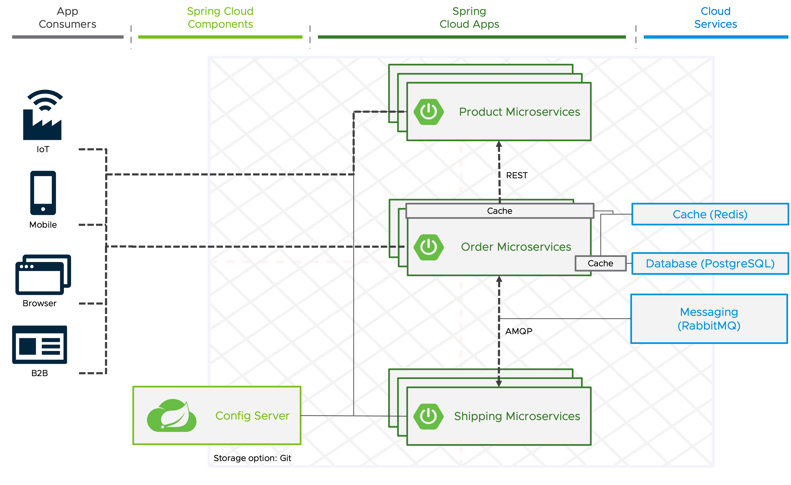
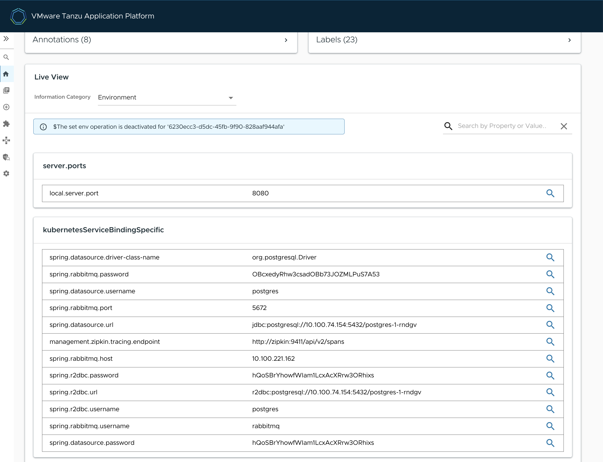
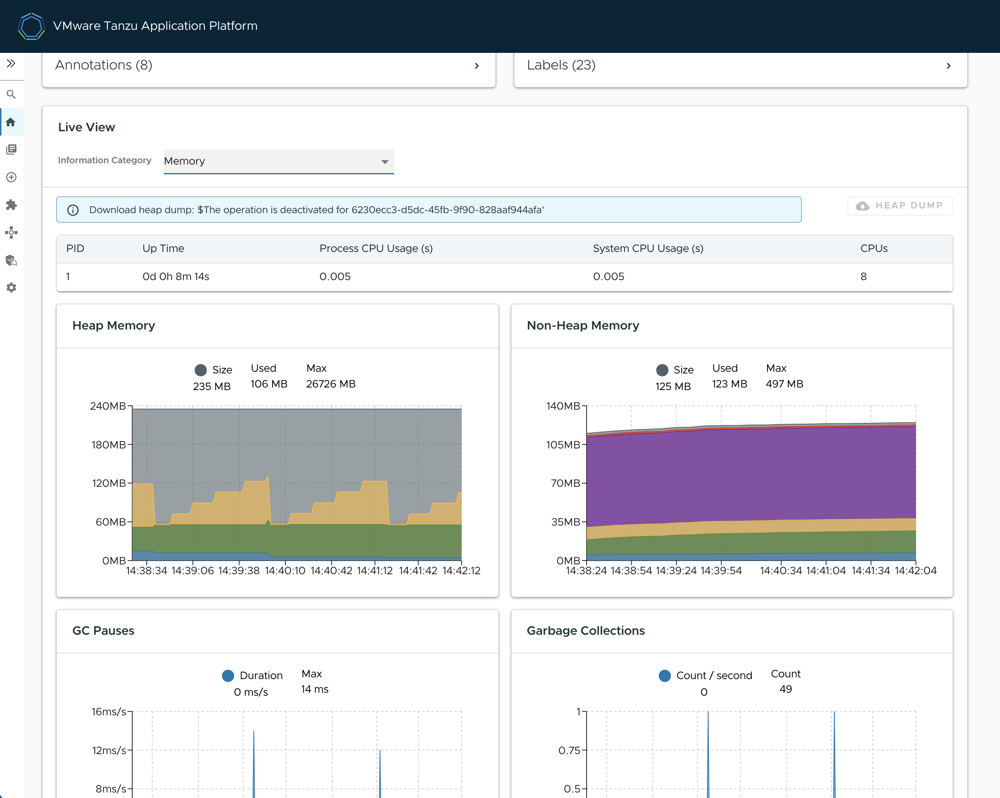

```terminal:interrupt
autostart: true
hidden: true
cascade: true
```
```terminal:execute
command: |
  (cd ~/order-service && [ "$(git rev-parse --is-inside-work-tree 2>/dev/null)" != "true" ] && git init -b main && git remote add origin $GIT_PROTOCOL://$GIT_HOST/order-service.git && git add . && git commit -m "Initial implementation" && git push -u origin main && tanzu apps workload apply -f config/workload.yaml -y)
  clear
hidden: true
cascade: true
```
```dashboard:open-dashboard
name: The Twelve Factors
hidden: true
```
**TAP components:** Services Toolkit

The **fourth and sixth factor** implies that any **data** that needs to be persisted must be **stored in a stateful backing service**, such as a database, because the processes are stateless and share-nothing.
A backing service is any service that your application needs for its functionality. Examples of the different types of backing services are data stores, messaging systems, and also services that provide business functionality.

Those backing services are handled as attached resources in a 12-factor app which can be swapped without changing the application code in case of failures.

##### Provisioning and consumption of backing services

TAP makes it easy as possible to discover, curate, consume, and manage backing services, such as databases, queues, and caches, across single or multi-cluster environments. 

This experience is made possible by using the **Services Toolkit** component. 

To demonstrate how a Spring Boot app can use backing services on TAP let's use the order-service.


The **order service** uses a **PostgreSQL database** to store orders.  We have both `spring-boot-starter-data-jpa` and `postgresql` on the classpath.

```
		<dependency>
			<groupId>org.springframework.boot</groupId>
			<artifactId>spring-boot-starter-data-jpa</artifactId>
		</dependency>
		<dependency>
			<groupId>org.postgresql</groupId>
			<artifactId>postgresql</artifactId>
			<scope>runtime</scope>
		</dependency>
```


The order service saves and updates orders to the database within the `OrderApplicationService` class.

```editor:open-file
file: ~/order-service/src/main/java/com/example/orderservice/order/OrderApplicationService.java
line: 32
```

The order service also uses **RabbitMQ** to asynchronously communicate with the **shipping service** and includes `spring-boot-starter-amqp` on the classpath.

```
		<dependency>
			<groupId>org.springframework.boot</groupId>
			<artifactId>spring-boot-starter-amqp</artifactId>
		</dependency>
```


The order service sends messages to the shipping service within the `ShippingService` using the `exchange` method.

```editor:open-file
file: ~/order-service/src/main/java/com/example/orderservice/order/ShippingService.java
line: 45
```

TAP provides developers with a self-service model to provision backing services for their applications.

In this workshop, we will run commands manually to dynamically provision backing services for our application - in production environments, this should be automated.

Let's first discover available service classes in the cluster. 
```terminal:execute
command: tanzu service class list
clear: true
```
This should result in a list that looks similar to 

```
  NAME                  DESCRIPTION               
  kafka-unmanaged       Kafka by Bitnami          
  mongodb-unmanaged     MongoDB by Bitnami        
  mysql                 MySQL DB Instances        
  mysql-unmanaged       MySQL by Bitnami          
  postgresql-unmanaged  PostgreSQL by Bitnami     
  rabbitmq              It's a RabbitMQ cluster!  
  rabbitmq-unmanaged    RabbitMQ by Bitnami       
  redis-unmanaged       Redis by Bitnami
```


There are several [Bitnami](https://bitnami.com) Helm charts for data services available, which are pre-installed with TAP as examples. Those services can run everywhere where Crossplane supports the provisioning, e.g. in a Kubernetes cluster or native on a public cloud.

The service classes abstraction and Crossplane make it also possible to have a different way of provisioning services in different environments without changing the workload or resources generated by the supply chain. So a PostgreSQL database in a test cluster could be dynamically provisioned as Helm Chart, while in a production environment, you could use a native AWS service. 

We can have a closer look at a service class in TAP to see available configuration options exposed by the platform operators by executing `tanzu servive class get`.

```terminal:execute
command: tanzu service class get postgresql-unmanaged
clear: true
```

Since the order service needs a PostgreSQL database, let's claim the pre-installed Bitnami PostgreSQL service to obtain such a database.
```terminal:execute
command: tanzu service class-claim create postgres-1 --class postgresql-unmanaged --parameter storageGB=1
clear: true
```
It might take a moment or two before the claim reports `Ready: True`. After the claim is ready, you then have a successful claim for a PostgreSQL database.
We can check whether the claim is ready by executing the following command.  The `status.Ready` value should be `True`.

```terminal:execute
command: tanzu services class-claims get postgres-1
clear: true
```
The order service also needs a RabbitMQ instance so create a claim for that service as well.

```terminal:execute
command: tanzu service class-claim create rmq-1 --class rabbitmq-unmanaged --parameter storageGB=1
clear: true
```
Before moving on let's make sure the `status.Ready` value of the RabbitMQ service claim is `True`.

```terminal:execute
command: tanzu services class-claims get rmq-1
clear: true
```
Now that we have created service claims for the services we need to bind them to the order service workload (just like we bound the configuration service to the product service earlier).
When these services are bound to the workload TAP will automatically set the correct Spring Data and Spring AMQP configuration properties for the username, password, and server URL using the [Service Binding Specification](https://github.com/k8s-service-bindings/spec) for Kubernetes. 

Let's add the necessary service claims to the workload for the order service.
```editor:insert-value-into-yaml
file: ~/order-service/config/workload.yaml
path: spec.serviceClaims
value:
- name: db
  ref:
    apiVersion: services.apps.tanzu.vmware.com/v1alpha1
    kind: ClassClaim
    name: postgres-1
- name: rmq
  ref:
    apiVersion: services.apps.tanzu.vmware.com/v1alpha1
    kind: ClassClaim
    name: rmq-1
```

After configuring the Workload definition for the service bindings on our machine, we have to update it on the cluster.
```terminal:execute
command: tanzu apps workload apply -f order-service/config/workload.yaml -y
clear: true
```
We can track the rollout of the latest version of the order service by tailing the logs.
```terminal:execute
command: tanzu apps workload tail order-service --since 1h
clear: true
```

As soon as the new version of the order service is deployed, we can see the TAP has bound our services to the app by checking the environment Actuator endpoint for a property source called `kubernetesServiceBindingSpecific`.

```terminal:execute
session: 2
command: watch -n 1 "curl -s https://order-service-{{ session_namespace }}.{{ ENV_TAP_INGRESS }}/actuator/env | jq '.propertySources[] | select(.name == \"kubernetesServiceBindingSpecific\")'"
clear: true
```
Once the new version of the order service is deployed, you should see the following JSON.
Since the `/env` and `/configprops` endpoints can contain sensitive values, starting with Spring Boot 3, all values are always masked by default. Like in our case, [this can be configured](https://github.com/spring-projects/spring-boot/wiki/Spring-Boot-3.0-Migration-Guide#actuator-endpoints-sanitization).

```
{
  "name": "kubernetesServiceBindingSpecific",
  "properties": {
    "spring.datasource.driver-class-name": {
      "value": "org.postgresql.Driver"
    },
    "spring.rabbitmq.password": {
      "value": "OBcxed..."
    },
    "spring.datasource.username": {
      "value": "postgres"
    },
    "spring.rabbitmq.port": {
      "value": "5672"
    },
    "spring.datasource.url": {
      "value": "jdbc:postgresql://10.100.74.154:5432/postgres-1-rndgv"
    },
    ...
  }
}
```


Let's interrupt the `watch` and `tail` commands.
```terminal:interrupt-all
```

##### Application Live View

You can also leverage TAP's powerful Application Live View, to view the information provided by the actuator endpoints. 
App Live View is currently available for pods running Spring Boot or .NET Steeltoe applications under the "Runtime Resources" tab. It **doesn't store any of that data** for further analysis or historical views. 

Execute the following command and click on the link in the terminal to open it for the order service in a new tab. 
```terminal:execute
command: |
  echo LINK TO APP LIVE VIEW: https://tap-gui.{{ ENV_TAP_INGRESS }}/catalog/default/Component/order-service/workloads/pods/$(kubectl get pods -l serving.knative.dev/service=order-service -o jsonpath='{.items[0].metadata.uid}')
```

**Scroll down to the "Live view" box** and **choose an "Information Category" in the drop-down** - for example the "Environment" category to see the same information as before with the terminal command.


There is a lot more information, like resource consumption or incoming API requests available.


Some functionality such as **editing environment variables, downloading heap dump data, and changing log levels for applications**, is not available by default and **has to be enabled by the platform operators for specific users or groups**.

Finally, we can test our order service by making a request to the endpoint.

```terminal:execute
command: |
  curl -s -X POST -H "Content-Type: application/json" -d '{"productId":"1", "shippingAddress": "Stuttgart"}' https://order-service-{{ session_namespace }}.{{ ENV_TAP_INGRESS }}/api/v1/orders | jq .
clear: true
```
If we now make a request to fetch the orders we should see the order we just created returned.

```terminal:execute
command: curl -s https://order-service-{{ session_namespace }}.{{ ENV_TAP_INGRESS }}/api/v1/orders | jq .
```

Let's see how we can make our application even more **resilient to backing service failures**.

##### Circuit Breaker

When we have several distributed apps with lots of dependencies on each other, there are bound to be issues.  Sometimes these issues are out of our control. For example, if the cloud provider we are running our apps on has a network outage, there is nothing we can really do about that. To better insulate ourselves from failures that are bound to happen in distributed apps, we can use a circuit breaker.  

To make this more concrete, take for example our order service's request to the product service.  We can wrap that request in a circuit breaker, and if the request fails past a certain threshold, the circuit breaker will "trip" and the request will no longer be made for a defined period of time.  

This gives the product service (or the underlying infrastructure) some time to recover while at the same time preventing a cascade of failures up the dependency chain of apps that could bring our entire system to a halt.

[Spring Cloud Circuit Breaker](https://spring.io/projects/spring-cloud-circuitbreaker) provides an abstraction over different circuit breaker implementations.  For this workshop we will use the [Resilience4J](https://resilience4j.readme.io/) implementation.

First, we have to add the required dependency to our `pom.xml`.
```editor:insert-lines-before-line
file: ~/order-service/pom.xml
line: 54
text: |2
      <dependency>
        <groupId>org.springframework.cloud</groupId>
        <artifactId>spring-cloud-starter-circuitbreaker-resilience4j</artifactId>
      </dependency>
```

To create a circuit breaker in your code, you can use a CircuitBreakerFactory.

The `ProductService` class within the order service is where we use `RestTemplate` to make a request to the product service.
We can wrap the request in a circuit breaker to provide some fault tolerance in our application.

To do this using Spring Cloud CircuitBreaker we can use a `CircuiBreakerFactor`.  An instance of `CircuitBreakerFactory` is configured for use via auto-configuration by placing the starter on our classpath, so all we need to do is use it in our `ProductService`.

```editor:select-matching-text
file: ~/order-service/src/main/java/com/example/orderservice/order/ProductService.java
text: "ProductService(RestTemplate restTemplate) {"
```
```editor:replace-text-selection
file: ~/order-service/src/main/java/com/example/orderservice/order/ProductService.java
text: |2
  private final CircuitBreakerFactory circuitBreakerFactory;
      ProductService(RestTemplate restTemplate, CircuitBreakerFactory circuitBreakerFactory) {
          this.circuitBreakerFactory = circuitBreakerFactory;
```

The `CircuitBreakerFactory.create` will create a `CircuitBreaker` instance that provides a run method that accepts a `Supplier` and a `Function` as an argument. 

The following commands will wrap our request in a circuit breaker and also provide what's known as a fallback, so in the case the circuit breaker is tripped, we still actually provide a response.

```editor:insert-lines-before-line
file: ~/order-service/src/main/java/com/example/orderservice/order/ProductService.java
line: 13
text: |
    import java.util.Collections;
    import org.springframework.cloud.client.circuitbreaker.CircuitBreakerFactory;
```

```editor:select-matching-text
file: ~/order-service/src/main/java/com/example/orderservice/order/ProductService.java
text: "return Arrays.asList(Objects.requireNonNull(restTemplate.getForObject(productsApiUrl, Product[].class)));"
```
```editor:replace-text-selection
file: ~/order-service/src/main/java/com/example/orderservice/order/ProductService.java
text: |2
      return Arrays.asList(Objects.requireNonNull(
            circuitBreakerFactory.create("products").run(
                () -> restTemplate.getForObject(productsApiUrl, Product[].class), 
                t -> {
                    log.error("Call to product service failed, using empty product list as fallback", t);
                    return new Product[]{};
                }
            )
        ));
```

The `Supplier` is the code that you are going to wrap in a circuit breaker. The `Function` is the fallback that will be executed if the circuit breaker is tripped. In our case, the fallback just returns an empty product array. The function will be passed the Throwable that caused the fallback to be triggered. You can optionally exclude the fallback if you do not want to provide one.

After pushing our changes to Git, the updated source code will be automatically deployed to production. 
```terminal:execute
command: |
  (cd order-service && git add . && git commit -m "Add circuit-breaker" && git push)
clear: true
```
Since TAP is monitoring changes in the order service Git repo pushing the changes in the above command will cause a new build and deploy of the order service to take place.

We can monitor the rollout of the new version of the order service by tailing the logs. 
```terminal:execute
session: 2
command: tanzu apps workload tail order-service --since 1h
clear: true
```
If we delete the pod running the product service and then make a request to create a new order, we should see an error come back indicating the order was not created.
***NOTE*** The below `kubectl delete app` command will delete the pod and all related Kubernetes resources for the runtime, but due to the configured continuous delivery workflow, those will be automatically recreated fairly quickly.

```terminal:execute
command: |
  kubectl delete app product-service
  curl -s -X POST -H "Content-Type: application/json" -d '{"productId":"1", "shippingAddress": "Stuttgart"}' https://order-service-{{ session_namespace }}.{{ ENV_TAP_INGRESS }}/api/v1/orders | jq .
clear: true
```

If everything works as expected the circuit breaker in the `ProductService.fetchProducts` method should be tripped and return an empty `List`.  In the logs of the order service, you should see the following error.


```
2023-08-10T14:31:25.229Z ERROR 1 --- [nio-8080-exec-5] c.e.orderservice.order.ProductService    : Call to product service failed, using empty product list as fallback
```


Since the order service cannot validate that the product with the id of `1` exists by making a request to the product service (due to the empty list being returned), the order service will return a `500` response code with the response body 


```
{
  "timestamp": "2023-08-10T14:37:47.298+00:00",
  "status": 400,
  "error": "Bad Request",
  "message": "The product with id 1 is currently not available for orders",
  "path": "/api/v1/orders"
}
```


Next, we will move on to adding some caching to our application.

```terminal:interrupt-all
```

##### Caching

As we talked about in the previous section on circuit breakers, failures are part of building distributed systems, this includes failures at the data layer of our application as well. If the PostgreSQL database of the order service is unreachable, what are we to do? One thing we can do to mitigate a failure at the data layer is to use a cache. 
[Spring Framework provides support for transparently adding caching](https://docs.spring.io/spring-framework/reference/integration/cache.html#page-title) to an application. 

The caching layer provided by the Spring Framework is just an abstraction allowing you as the developer to pick the caching implementation you would like to use. Examples of cache providers that are supported out of the box are **EhCache, Hazelcast, Couchbase, Redis, and Caffeine**.

To make the order service more resilient to failures at the data layer, let's take advantage of Spring Frameworks caching abstraction and add caching to our application.
In this example, we will use **Redis** as our caching implementation.

Let's first claim the pre-installed Bitnami Redis service to obtain an instance for the service.
```terminal:execute
command: tanzu service class-claim create redis-1 --class redis-unmanaged --parameter storageGB=1
clear: true
```
As with the other service claims, we want to make sure the Redis service is marked as Ready before moving on. Execute the following command to check the Ready status. If it is `False` wait a moment and check again.
```terminal:execute
command: tanzu services class-claims get redis-1
clear: true
```

Now we can add a service binding to our Workload to bind the order service to the Redis instance.
```editor:insert-value-into-yaml
file: ~/order-service/config/workload.yaml
path: spec.serviceClaims
value:
  - name: cache
    ref:
      apiVersion: services.apps.tanzu.vmware.com/v1alpha1
      kind: ClassClaim
      name: redis-1
```

Next, the required libraries have to be added to our `pom.xml`.
```editor:insert-lines-before-line
file: ~/order-service/pom.xml
line: 58
text: |2
      <dependency>
        <groupId>org.springframework.boot</groupId>
        <artifactId>spring-boot-starter-cache</artifactId>
      </dependency>
      <dependency>
        <groupId>org.springframework.boot</groupId>
        <artifactId>spring-boot-starter-data-redis</artifactId>
      </dependency>
```

We need to enable Spring Framework's caching abstraction by adding the `@EnableCaching` annotation on a @Configuration class, in this case, the `OrderServiceApplication`.

```editor:insert-lines-before-line
file: ~/order-service/src/main/java/com/example/orderservice/OrderServiceApplication.java
line: 13
text: |
    import org.springframework.cache.annotation.EnableCaching;
cascade: true
```
```editor:insert-lines-before-line
file: ~/order-service/src/main/java/com/example/orderservice/OrderServiceApplication.java
line: 15
text: |
    @EnableCaching
```

First, let's add a cache for the HTTP request to the product service. We can do this by adding `@Cacheable` to the `fetchProducts` method.  Within the `@Cachable` annotation, we specify a name for the cache, in this case, `Products`.

```editor:insert-lines-before-line
file: ~/order-service/src/main/java/com/example/orderservice/order/ProductService.java
line: 13
text: |
    import org.springframework.cache.annotation.Cacheable;
cascade: true
```
```editor:insert-lines-before-line
file: ~/order-service/src/main/java/com/example/orderservice/order/ProductService.java
line: 35
text: |2
      @Cacheable("Products")
```

We can also add a cache for the data from the PostreSQL database the order service uses. To do this, we first have to override all the used methods of the `JpaRepository` to be able to add related annotations. 
```editor:insert-lines-before-line
file: ~/order-service/src/main/java/com/example/orderservice/order/OrderRepository.java
line: 8
text: |2
      @Cacheable("Orders")
      @Override
      List<Order> findAll();

      @Cacheable("Order")
      @Override
      Optional<Order> findById(Long id);

      @Override
      <S extends Order> S save(S order);
cascade: true
```
```editor:insert-lines-before-line
file: ~/order-service/src/main/java/com/example/orderservice/order/OrderRepository.java
line: 5
text: |
     import org.springframework.cache.annotation.Cacheable;

     import java.util.List;
     import java.util.Optional;
```

The cache abstraction not only allows populating caches but also allows removing the cached data with the `@CacheEvict` annotation.  When we save a new order it makes sense to evict the orders and order caches as they are now invalid.
```editor:insert-lines-before-line
file: ~/order-service/src/main/java/com/example/orderservice/order/OrderRepository.java
line: 6
text: |
     import org.springframework.cache.annotation.CacheEvict;
cascade: true
```
```editor:insert-lines-before-line
file: ~/order-service/src/main/java/com/example/orderservice/order/OrderRepository.java
line: 21
text: |2
      @CacheEvict(cacheNames = {"Order", "Orders"}, allEntries = true)
```

Let's deploy a new version of the order service, which now has support for caching, by committing the code to our Git repo, and updating the order service's workload because we added a new service binding.
```terminal:execute
command: |
  (cd order-service && git add . && git commit -m "Add caching" && git push)
clear: true
```
```terminal:execute
command: tanzu apps workload apply -f order-service/config/workload.yaml -y
clear: true
```
Just as before we can tail the logs of the order service to monitor the deployment of our new order service.
```terminal:execute
command: tanzu apps workload tail order-service --since 1h
clear: true
```

Alternatively, you can also watch the rollout in the supply chain UI.
```dashboard:open-url
url: https://tap-gui.{{ ENV_TAP_INGRESS }}/supply-chain/host/{{ session_namespace }}/order-service
```

The order service has `TRACE` level logging enabled for Spring Frameworks caching abstraction in its `application.yaml`.

```
logging.level.org.springframework.cache: TRACE
```


We can use this `TRACE` logging to see the caching in action in the order service.
If we make a request to `/api/v1/orders` the first time after the application has been deployed, we should see that there is no cache present for `Orders`.

```terminal:execute
session: 2
command: curl -s https://order-service-{{ session_namespace }}.{{ ENV_TAP_INGRESS }}/api/v1/orders | jq .
clear: true
```
In the logs generated from the above request, you will see `No cache entry for key 'SimpleKey []' in cache(s) [Orders]`.


```
TRACE 1 --- [nio-8080-exec-7] o.s.cache.interceptor.CacheInterceptor   : Computed cache key 'SimpleKey []' for operation Builder[public abstract java.util.List com.example.orderservice.order.OrderRepository.findAll()] caches=[Orders] | key='' | keyGenerator='' | cacheManager='' | cacheResolver='' | condition='' | unless='' | sync='false'
TRACE 1 --- [nio-8080-exec-7] o.s.cache.interceptor.CacheInterceptor   : No cache entry for key 'SimpleKey []' in cache(s) [Orders]
```


Now if we make the same request again, we should see that there was a cache hit (`Cache entry for key 'SimpleKey []' found in cache 'Orders'`), and the cached orders are returned.

```terminal:execute
session: 2
command: curl -s https://order-service-{{ session_namespace }}.{{ ENV_TAP_INGRESS }}/api/v1/orders | jq .
clear: true
```


```
TRACE 1 --- [nio-8080-exec-1] o.s.cache.interceptor.CacheInterceptor   : Computed cache key 'SimpleKey []' for operation Builder[public abstract java.util.List com.example.orderservice.order.OrderRepository.findAll()] caches=[Orders] | key='' | keyGenerator='' | cacheManager='' | cacheResolver='' | condition='' | unless='' | sync='false'
TRACE 1 --- [nio-8080-exec-1] o.s.cache.interceptor.CacheInterceptor   : Cache entry for key 'SimpleKey []' found in cache 'Orders'
```


Let's interrupt our terminals before moving on.

```terminal:interrupt
session: 1
```
Our updated architecture diagram is below.

