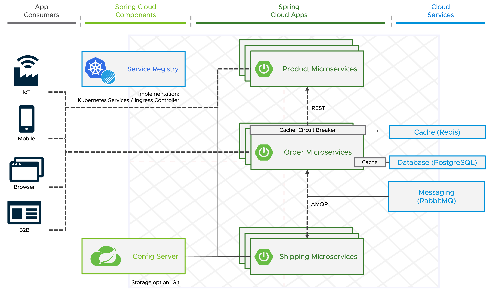
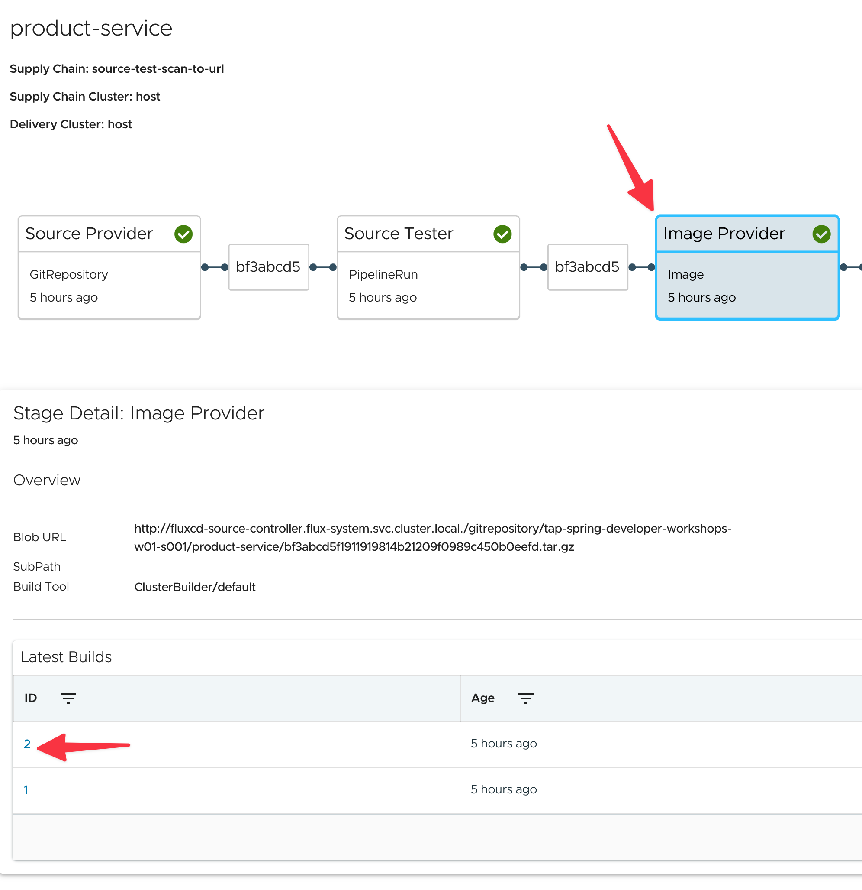
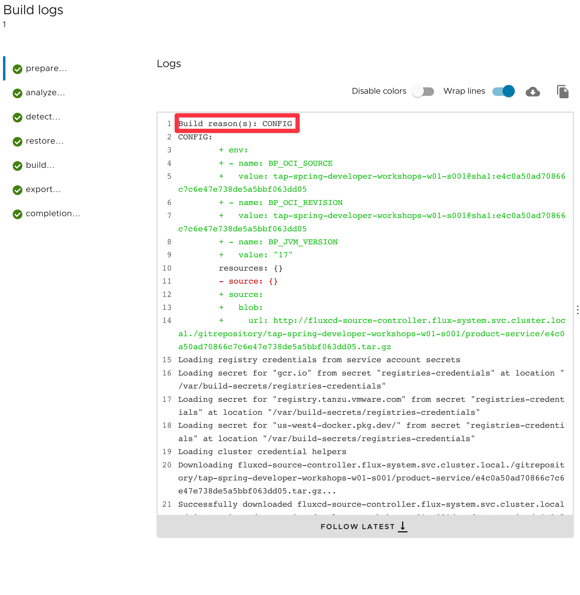

```dashboard:open-dashboard
name: The Twelve Factors
```

#### Factor 5: Build, release, run
The **fifth factor** calls for the **strict separation between the build, release, and run stages**. 
As we already learned, in TAP uses [Cartographer](https://cartographer.sh) to construct a supply chain with build, release, and run stages.

#### Factor 7: Port binding

Factor 7 states **services need to be exposed for external or inter-service access with well-defined ports**.

[Spring Cloud's `ServiceRegistry` interface](https://docs.spring.io/spring-cloud-commons/docs/current/reference/html/#discovery-client) solves this problem and provides client-side libraries for **service registry implementations such as Consul, Zookeeper, Eureka, plus Kubernetes**.

In Kubernetes, each service can interface with another service by using its service name, which is **resolved by Kubernetes DNS support, and the benefit of the Spring Cloud's Registry interface is limited**. 

**Due to even more capabilities like proper load balancing, we decided to use the Ingress Controller Contour as a solution for the factor**.



####  Factor 10: Dev/prod parity

The tenth factor emphasizes the **importance of keeping all of our environments as similar as possible** to minimize potential discrepancies that could lead to unexpected behavior in production.
**Containers play a crucial role in achieving this** by encapsulating the application and its dependencies, including the operating system, ensuring that it runs consistently across different environments. 

As we have mentioned earlier in this workshop TAP uses Cloud Native Buildpacks (CNBs) detect what is needed to compile and run an application based on the application's source code.
The application is then compiled and packaged in a container image with best practices in mind by the appropriate buildpack.

The biggest benefits of CNBs are increased security, minimized risk, and increased developer productivity because they don't need to care much about the details of how to build a container.

**Spring Boot version 2.3.0 introduced Cloud Native Buildpack support** to simplify container image creation. You can create a container image using the open-source [Paketo buildpacks](https://paketo.io) with the following commands for Maven and Gradle.
```
./mvnw spring-boot:build-image -Dspring-boot.build-image.imageName=myorg/myapp
./gradlew bootBuildImage --imageName=myorg/myapp
```

With all the benefits of Cloud Native Buildpacks, one of the **biggest challenges with container images still is to keep the operating system, used libraries, etc., up-to-date** in order to minimize attack vectors by CVEs.

With **VMware Tanzu Build Service (TBS)**, which is part of TAP and based on an open source project called [kpack](https://github.com/buildpacks-community/kpack), it's possible **automatically recreate and push an updated container image to the target registry if there is a new version of the buildpack or the base operating system available** (e.g. due to a CVE).

All of this is part of TAP's Supply Chain, making it possible to deploy security patches automatically.

In the details of the Image Provider step in **TAP-GUI**, you're able to see the **logs of the container build and the tag of the produced image**.

It also shows the reason for an image build. In this case, it's due to our configuration change.

You can open the supply chain for the product service using the link below and view all these details.

```dashboard:open-url
url: https://tap-gui.{{ ENV_TAP_INGRESS }}/supply-chain/host/{{ session_namespace }}/product-service
```





####  Factor 11: Logs

Factor eleven states that **Logs should be treated as event streams**.
The key point with logs in a cloud-native application is that it writes all of its log entries to stdout and stderr and the aggregation, processing, and storage of logs is a nonfunctional requirement that is satisfied by your platform or cloud provider.

For developers, TAP-GUI also provides the capability to view the logs of your application.

Execute the following command and click on the link in the terminal to open the logs view for the product service in a new tab. 
```terminal:execute
command: |
  echo LINK TO LOGS VIEW: https://tap-gui.{{ ENV_TAP_INGRESS }}/catalog/default/Component/product-service/workloads/pods/$(kubectl get pods -l serving.knative.dev/service=product-service -o jsonpath='{.items[0].metadata.uid}')/logs
description: Post link to logs view for the product service in terminal
clear: true
```

We also saw a way of tailing the logs of any workload using `tanzu app workloads tail` CLI command throughout this workshop already.

####  Factor 12: Admin processes

The final factor states that administrative tasks, such as database migrations and one-time scripts, should be executed in the same environment and manner as regular application code. 
This factor is a bit outdated. You should avoid administrative processes as much as possible for security reasons and try to find a design/architecture that suits your needs better.

**Factors eight and nine will be covered in the next section**.
