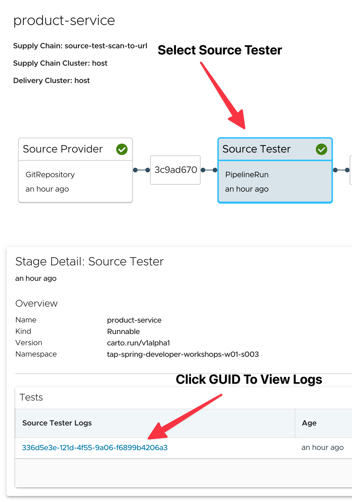
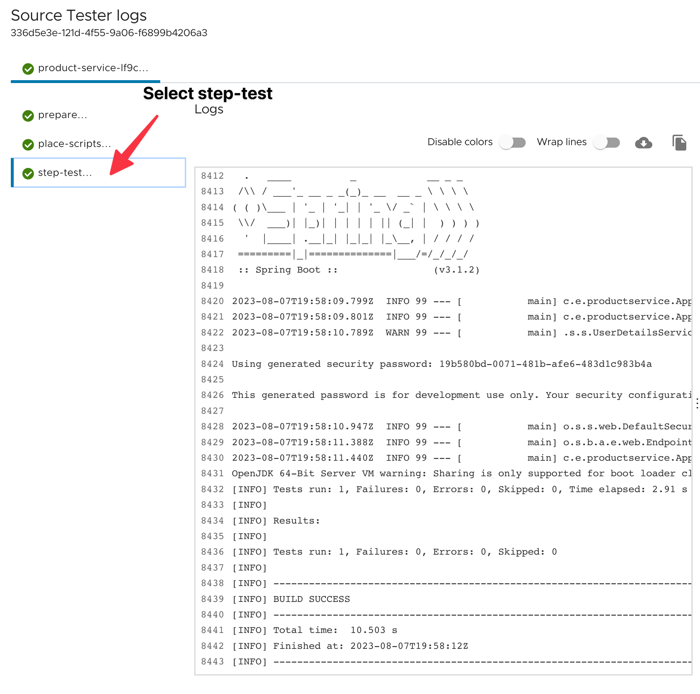

Let's first have a look at the Continuous integration (CI) part of the supply chain, which automates the process of building and testing the application we like to deploy.

The first step in the path to production **watches** the **repository with the source code** configured in the Workload for new commits and makes the source code available as an archive via HTTP. 

##### Source Tester
 
The Source Tester uses [Tekton](https://tekton.dev) by default to execute tests part as part of the pipeline.

TAP ships with an out of the box test pipeline for Spring Boot applications.  We can see the test pipeline definition by running the following command.
```execute
kubectl eksporter Pipeline --keep metadata.labels
```
Let's open the supply chain of the `product-service` app we just deployed and view the test logs from the Source Tester step.

```dashboard:open-url
url: https://tap-gui.{{ ENV_TAP_INGRESS }}/supply-chain/host/{{ session_namespace }}/product-service
```

In the supply chain UI select Source Tester, then click the GUID in the Stage Details.



In the resulting popup window select step-test to view the logs from running `mvn test`.




##### Image Provider

Since TAP is built upon Kubernetes we need to package our application into a container, this is what the image provider step does.

The most obvious way to do this is to write a Dockerfile, run `docker build`, and push it to the container registry of our choice via `docker push`.

For the building of container images from a Dockerfile, TAP uses the open-source tool [kaniko](https://github.com/GoogleContainerTools/kaniko).
If you want to use a Dockerfile you can setup your applications Workload to do so using the following `spec.params`. 
```
apiVersion: carto.run/v1alpha1
kind: Workload
...
spec:
  params:
  - name: dockerfile
    value: ./Dockerfile
...
```

However contructing a Dockerfile that is both optomized and free from security issues can be quite challenging for most developers, and frankly is not something they want to have to concern themselves with.  
On TAP the default approach to building a container image for your application is to use [Cloud Native Buildpacks](https://buildpacks.io/). The benefit of using Cloud Native Buildpacks is that the buildpack takes care of compiling your application into a container image that is both secure and optomized.  The best part is all you need to do is provide TAP with the source code for your application (which we already did in our application's Workload).


##### Image Scanner

In the next step, the built **image will be scanned** for known vulnerabilities.

**Go to TAP-GUI** and have a look at the details view of the Image Scanner step of the supply chain. You can see that some critical were found by the scanner. 
You can **click on the CVE's ID** to get more information.

```dashboard:open-url
url: https://tap-gui.{{ ENV_TAP_INGRESS }}/supply-chain/host/{{ session_namespace }}/product-service
```

The TAP-GUI also provides a dashboard to discover all the CVEs in the organizations and workloads that are affected.
```dashboard:open-url
url: https://tap-gui.{{ ENV_TAP_INGRESS }}/security-analysis
```

For image scans to happen, **scan policies** must be defined on a namespace level which can be done during the automated provisioning of new namespaces. It defines how to evaluate whether the artifacts scanned are compliant, for example, allowing one to be either very strict or restrictive about particular vulnerabilities found. 
If an artifact is not compliant, the application will not be deployed.

Let's go back to the visualization of the supply chain and **click on the policy name in the detail view of the Image Scanner**.

Our image can step didn't fail because the `notAllowedSeverities`configuration in the scan policy is only set to `["UnknownSeverity"]`. If that would be different, it's also possible to whitelist CVEs with the `ignoreCves` configuration.

The **container image includes the full stack** required to run the application which includes more information than just running a source code scan (**for source code scans, most of the CVE scanners don't download the dependencies, which leads often to false positives or missed CVEs**).


##### Config Provider, App Config, Service Bindings, Api Descriptors 

The steps between "Image Scanner" and "Config Writer" in the supply chain generate the YAML of all the Kubernetes resources required to run the application.

##### Config Writer 
After generating the YAML of all the Kubernetes resources required to run the application, it's time to apply them to a cluster. Usually, there is more than one cluster the application should run on, for example, on a test cluster before production.

The Config Writer is responsible for writing the YAML files either to a Git repository for **GitOps** or, as an alternative, packaging them in a container image and pushing it to a container registry for **RegistryOps**.

**The workshop environment is configured for RegistryOps.**

##### Delivery
With the deployment configuration of our application available, we are now able to deploy it automatically to a fleet of clusters on every change. 
**Cartographer** also **provides a way to define a continuous delivery workflow** resource on the target cluster, which e.g. picks up that configuration, deploys it, and maybe runs some automated integration tests.

For the sake of simplicity, our application is deployed to the same cluster we used for building it. 

In the next section, you'll get some information about components that are relevant for the running application.
