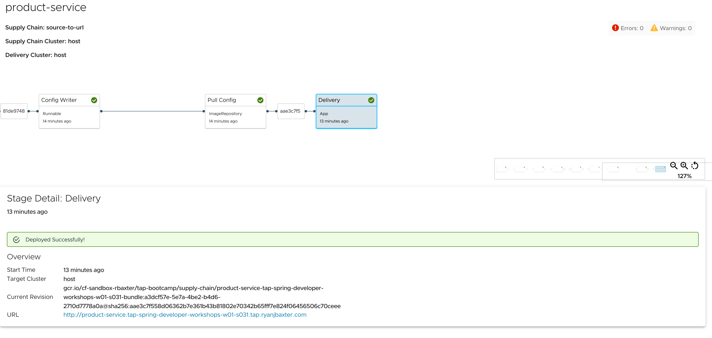

```terminal:interrupt
autostart: true
hidden: true
```

To handle the more complex deployment and operations of modern applications, there is a need for a culture change towards **DevSecOps**, a buzzword for improved collaboration between developers, security, and operations teams.
This collaboration should be **supported by automated processes**, like a self-service for developers to get access to the tools they need.

The automated process of testing and deploying applications into production is called **Continuous Integration** and **Continuous Delivery** (CI/CD). 

The CI/CD tools universe is always in flux, but most solutions pose the same challenges. They use for example an **orchestration model** where the orchestrator executes, monitors, and manages each of the steps of the path to production **synchronously**, and **each of the applications has a different path to production**.

VMware Tanzu Application Platform uses the open-source [Cartographer](https://cartographer.sh) that allows developers to focus on delivering value to their users and provides operators the assurance that all code in production has passed through all the steps of a pre-approved path to production.

Cartographer allows operators via the **Supply Chain** abstraction to define all of the steps that an application must go through in a path to production, like container image creation or CVE scanning.

By design, **a supply chain can be used by many workloads of a specific type**, like any web application. 


VMware Tanzu Application Platform provides **full integration of all of its components via out-of-the-box supply chains** that can be customized for your processes and tools.

While the supply chain is operator-facing, Cartographer also provides an **interface for developers** called **Workload**. Workloads allow developers to create application specifications such as the location of their repository, environment variables, and service claims.

Let's have a closer look at how a Workload allows developers to configure the continuous path to production.
```editor:open-file
file: ~/product-service/config/workload.yaml
```

In addition to the name of the Workload, there is also `app.kubernetes.io/part-of` label with the same value, which is used by Tanzu Developer Portal to match documentation with runtime resources.

The location of an application's source code can be configured via the `spec.source` field. Here, we are using a branch of a Git repository as a source to be able to implement a **continuous path to production** where every git commit to the codebase will trigger another execution of the supply chain, and developers only have to apply a Workload once if they start with a new application or microservice. 

There are more many more configuration options available which you can have a look at in the detailed specification here:
```dashboard:open-url
url: https://cartographer.sh/docs/v0.7.0/reference/workload/
```
We will explore some of these throughout the workshop as we continue on.

Before we can deploy the workload to TAP we first need to commit the code to a Git repo.
Execute the command below to initialize the Git repo for the product service and push it to a remote Git repo which is pointed to in the `workload.yaml`.

```terminal:execute
command: (cd product-service && git init -b main && git remote add origin {{ git_protocol }}://{{ git_host}}/product-service.git && git add . && git commit -m "Initial implementation" && git push -u origin main)
description: Create a Git repository and commit generated code
clear: true
```

To create the Workload, we can use `tanzu apps workload create`.  
```execute
tanzu apps workload apply -f product-service/config/workload.yaml -y
```

We can monitor the supply chain for the `product-service` in the terminal by using the `tanzu apps workload tail` command.
```terminal:execute
session: 1
command: |
  tanzu apps workload tail product-service --since 1h
```
Just like in the previous section, we can monitor the status of the Knative service for the product service.  Once it is marked as `Ready` we know the application has finished being deployed.

```terminal:execute
session: 2
command: |
  watch -n 1 kubectl get service.serving.knative.dev product-service
```

In addition to monitoring the supply chain in the terminal, we can also monitor in the Tanzu Developer Portal.
```dashboard:open-url
url: https://tap-gui.{{ ENV_TAP_INGRESS }}/supply-chain/host/{{ session_namespace }}/product-service
```

After the supply chain completes, you will see the logs of the `product-service` application stream to the terminal, and you will see the Delivery step marked as completed in the Tanzu Developer Portal.



At this point, the application is up and running so we can test it out by making a request to the `/api/v1/products` endpoint.

```terminal:interrupt
session: 2
```

```terminal:execute
session: 2
command: |
  curl -s https://product-service-{{ session_namespace }}.{{ ENV_TAP_INGRESS }}/api/v1/products | jq .
```

When you execute the `curl` command, you should see the following response

```
[
  {
    "id": 1,
    "name": "VMware Tanzu Application Platform"
  },
  {
    "id": 2,
    "name": "VMware Spring Runtime"
  }
]
```

If you are still tailing the logs from the `product-service` you will also notice there is an `INFO` level log that gets printed indicating that fetch products was called

```
product-service-00001-deployment-57bb88c6f7-xn42x[workload] 2023-08-03T15:56:28.015314355Z 2023-08-03T15:56:28.014Z  INFO 1 --- [nio-8080-exec-9] c.e.p.product.ProductApplicationService  : Fetch products called
```

Let's stop tailing the logs from the `product-service` and move on to the next step of the workshop.

```terminal:interrupt
session: 1
```
