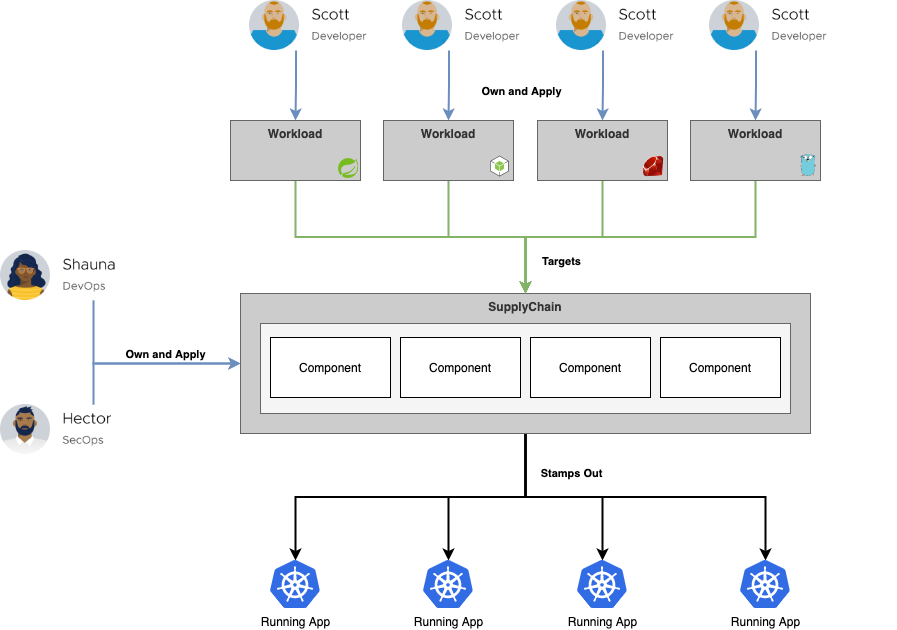

**TODO: Shorten text**

To handle the more complex deployment and operations of modern applications, there is a need for a culture change towards **DevSecOps**, a buzzword for improved collaboration between developers, security, and operations teams.
This collaboration should be **supported by automated processes**, like a self-service for developers to get access to the tools they need.

The automated process of testing and deploying applications into production is called **Continuous Integration** and **Continuous Delivery** (CI/CD). 

The CI/CD tools universe is always in flux, but most solutions pose the same challenges.  

- They use an **orchestration model** where the orchestrator executes, monitors, and manages each of the steps of the path to production **synchronously**. If, for example, a path to production has a vulnerability scanning step, and a new CVE should arise, the only way to scan the code for it would be to trigger the orchestrator to initiate the scanning step or a new run through the supply chain.
- **A different path to production for each of the applications**. Even if all the pipelines are based on one template, it's hard to update all of them if the template changes.
- **No Separation of concerns** between the users and authors of the pipeline.
- The **developer experience is lacking**.

#### Introducing Cartographer - A Supply Chain Choreographer for Kubernetes


VMware Tanzu Application Platform uses the open-source [Cartographer](https://cartographer.sh) that allows developers to focus on delivering value to their users and provides operators the assurance that all code in production has passed through all the steps of a pre-approved path to production.

Cartographer allows operators via the **Supply Chain** abstraction to define all of the steps that an application must go through in a path to production, like container image creation or CVE scanning.

By design, **a supply chain can be used by many workloads of a specific type**, like any web application. 


VMware Tanzu Application Platform provides **full integration of all of its components via out-of-the-box supply chains** that can be customized for your processes and tools.

While the supply chain is operator-facing, Cartographer also provides an **interface for developers** called **Workload**. Workloads allow developers to create application specifications such as the location of their repository, environment variables, and service claims.

Let's have a closer look at how a Workload allows developers to configure the continuous path to production.

```editor:open-file
file: ~/product-service/config/workload.yaml
```

In addition to the name of the Workload, there is also `app.kubernetes.io/part-of` label with the same value, which is used by for example the TAP GUI to match documentation with runtime resources.

The location of an application's source code can be configured via the `spec.source` field. Here, we are using a branch of a Git repository as a source to be able to implement a **continuous path to production** where every git commit to the codebase will trigger another execution of the supply chain, and developers only have to apply a Workload once if they start with a new application or microservice. 
For the to-be-deployed application, the Workload custom resource also provides configuration options for a **pre-built image in a registry** from e.g. an ISV via `spec.image`.

Other configuration options are available for resource constraints (`spec.limits`, `spec.requests`) and environment variables for the build resources in the supply chain (`spec.build.env`) and to be passed to the running application (`spec.env`).

Last but not least via (`.spec.params`), it's possible to override default values of the additional parameters that are used in the Supply Chain but not part of the official Workload specification.

There are more configuration options available which you can have a look at in the detailed specification here:
```dashboard:open-url
url: https://cartographer.sh/docs/v0.7.0/reference/workload/
```

If developers have access to a namespace in the Kubernetes cluster the supply chain is available, they can use the **tanzu CLI** as a higher abstraction to apply a Workload.
```
tanzu apps workload create -f workload.yaml
```
Instead of using a YAML file with the configurations, there are also flags for all of them available.
```
tanzu apps workload create sample --git-repo https://github.com/... --git-branch main --type web
```
The "kubectl" CLI can also be used to apply a custom Workload resource.
```
kubectl apply -f workload.yaml
```

Using **GitOps** to apply the Workload has the benefit that **developers don't need access to the Kubernetes cluster**, and once a change is triggered in Git by a developer, it's applied to the environment with little or no involvement from operations.

**TODO: Use local source code**
As we have Kuberetens access from the workshop environment, let's apply our configuration via the tanzu CLI.
```execute
tanzu apps workload create -f product-service/config/workload.yaml -y
```

We'll now have a closer look at TAP-GUI for a visualization of all the different steps of the supply chain and the capabilities of the tools they're implemented with.
```dashboard:open-url
url: https://tap-gui.{{ ENV_TAP_INGRESS }}/supply-chain/host/{{ session_namespace }}/product-service
```