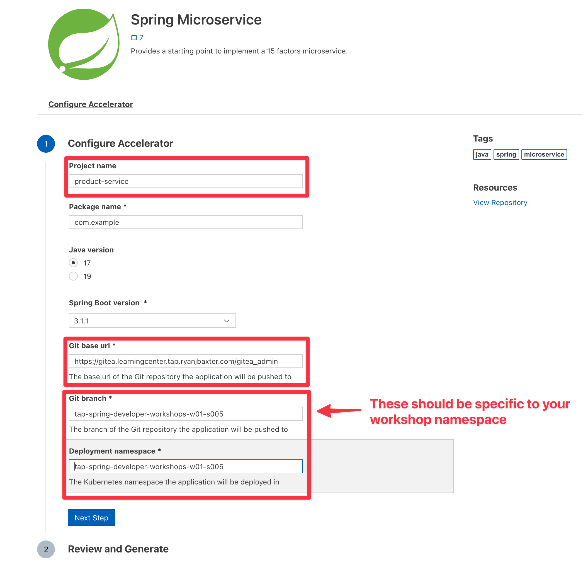

Before we have a closer look at the challenges of our typical microservice application, let's **implement** one of the services from scratch - in this case the **product service**.

The easiest way to get started you're probably familiar with is visiting [start.spring.io](https://start.spring.io), select your Spring Boot version and the dependencies you want to use.

Inspired by the Spring Initializr, **Application Accelerators for VMware Tanzu** enables developers to create new applications based on templates implemented in any technology that follow enterprise standards of your organization. This accelerates how you go from idea to production with ready-made, enterprise-conformant code and configurations without needing to read tons of docs straight away.

By clicking on the below link, you will open the IDE plugin to see a list of Accelerators available.
```editor:execute-command
command: workbench.view.extension.tanzu-app-accelerator
```

Select the **Spring Microservice** accelerator from the list, and change the following values in the form:
- **Name:** 
```copy
product-service
```
- **Git base url:**
```copy
{{ ENV_GITEA_BASE_URL}}
```
- **Git branch and deployment namespace:**
```copy
{{ session_namespace }}
```



- Press **Next Step**
- Press **Generate Project**. When you click on **Generate Project** there will be a popup window that opens at the top of the Editor with the path `/home/eduk8s/`, click **OK** to accept the defaults.


- The Accelerator has now generated the code.  You will see a pop up in the bottom right hand corner of the IDE asking if you want to open the project in a new tab.  Click **No** to open the new project in the current window.


Next lets add the code generated by the accelerator to a Git repo.  The following command will initialize the git repo locally, add a remote repo, and commit and push the code to the remote repository.

```terminal:execute
command: cd product-service && git init -b {{ session_namespace }} && git remote add origin {{ ENV_GITEA_BASE_URL}}/product-service.git && git add . && git commit -m "Initial implementation" && git push -u origin {{ session_namespace }} && cd ..
clear: true
```

With the code commited to a git repo lets start building out the product service.

Before we add any code though, lets first look at what the accelerator created for us.

First head back to the IDE by clicking the command below.

```editor:execute-command
command: workbench.view.explorer
```

Lets first look at the `pom.xml` file.

```editor:open-file
file: product-service/pom.xml
```

You will see we are using Java 17, Spring Boot 3.1.1, Spring Cloud 2022.0.3, and also including the dependencies `spring-boot-starter-web`, `spring-boot-starter-actuator`, and `spring-boot-starter-security`.

The accelerator also generated a main `Application` class for us which we can use to run our application.

```editor:open-file
file: product-service/src/main/java/com/example/productservice/Application.java
```

It also generated another class called `ProductResource`.


```editor:open-file
file: product-service/src/main/java/com/example/productservice/product/ProductResource.java
```

`ProductResource` is a `RestController` with a single endpoint at `/api/v1/products` which returns `Hello World`.

We want to change this endpoint to return a list of products so first lets create a way of representing a product in our application.

Click the command below to create a `Product` class.

```editor:append-lines-to-file
file: ~/product-service/src/main/java/com/example/productservice/product/Product.java
text: |2
  package com.example.productservice.product;

  public class Product {

      private Long id;
      private String name;

      private Product(Long id, String name) {
          this.id = id;
          this.name = name;
      }

      public static Product create(Long id, String name) {
          return new Product(id, name);
      }

      public Long getId() {
          return id;
      }

      public void setId(Long id) {
          this.id = id;
      }

      public String getName() {
          return name;
      }

      public void setName(String name) {
          this.name = name;
      }
  }
```

Now lets add a `Service` that we can use to fetch a list of products.  

Click the command below to add the `ProductApplicationService` class.

```editor:append-lines-to-file
file: ~/product-service/src/main/java/com/example/productservice/product/ProductApplicationService.java
text: |2
  package com.example.productservice.product;

  import org.slf4j.Logger;
  import org.slf4j.LoggerFactory;
  import org.springframework.beans.factory.annotation.Value;
  import org.springframework.stereotype.Service;

  import java.util.List;
  import java.util.stream.Collectors;

  @Service
  public class ProductApplicationService {

      private static final Logger log = LoggerFactory.getLogger(ProductApplicationService.class);

      @Value("${product-service.product-names}")
      private List<String> productNames;

      List<Product> fetchProducts() {
          log.info("Fetch products called");
          return productNames.stream()
                  .map(name -> Product.create((long) (productNames.indexOf(name) + 1), name))
                  .collect(Collectors.toList());
      }
  }
```

The `ProductApplicationService.fetchProducts` method returns a list of `Product`s created from the configuration property `product-service.product-names`.

Now lets modify `ProductResource` so it uses `ProductApplicationService` to fetch the list of products and return them when a
`GET` request is made to `/api/v1/products`.

```editor:insert-lines-before-line
file: ~/product-service/src/main/java/com/example/productservice/product/ProductResource.java
line: 5
text: "import java.util.List;"
```

```editor:insert-lines-before-line
file: ~/product-service/src/main/java/com/example/productservice/product/ProductResource.java
line: 11
text: |2
    private final ProductApplicationService productApplicationService;

    ProductResource(ProductApplicationService productApplicationService) {
        this.productApplicationService = productApplicationService;
    }
```

```editor:select-matching-text
file: ~/product-service/src/main/java/com/example/productservice/product/ProductResource.java
text: "Hello World"
before: 1
```
```editor:replace-text-selection
file: ~/product-service/src/main/java/com/example/productservice/product/ProductResource.java
text: |2
    public ResponseEntity<List<Product>> fetchProducts() {
        return ResponseEntity.ok(productApplicationService.fetchProducts());
```

The `ProductApplicationService` requires the property `product-service.product-names` to be set with a list of names.

```editor:select-matching-text
file: ~/product-service/src/main/java/com/example/productservice/product/ProductApplicationService.java
text: "@Value"
before: 1
```

Lets add this property to `product-service/src/main/resources/application.yaml`.

```editor:append-lines-to-file
file: ~/product-service/src/main/resources/application.yaml
text: "product-service.product-names: VMware Tanzu Application Platform"
```
Since we also have an `application.yaml` in `product-service/src/test/resources` for testing purposes we also need to add it there as well.

```editor:append-lines-to-file
file: ~/product-service/src/test/resources/application.yaml
text: "product-service.product-names: VMware Tanzu Application Platform"
```

Let's commit the updated source code.
```terminal:execute
command: |
  cd product-service && git add . && git commit -m "Add business code" && git push
  cd ..
clear: true
```
Lets test this out on TAP!

We can use a utility called Tilt to deploy our code from our IDE.  In addition Tilt will port forward port `8080` for us to the 
running container.

The Tanzu CLI has a developer friendly feature called live update which allows us to modify our code in the IDE
and instantly replacing the code running in the container with the modified code allowing us to instantly see the changes we made.  
This will feel very familiar if you are familiar with using Spring Dev Tools locally.

The accelerator we used already created a `Tiltfile` for us which instructs Tilt what to do.

```editor:open-file
file: product-service/Tiltfile
```

To run this file all we need to do is run the command `tilt up`

```terminal:execute
command: |
  tilt up --file ./product-service/Tiltfile --stream
clear: true
```
TAP will deploy the application using the source from our local file system.  After several minutes you should see the logs from your 
Spring Boot app appear in the terminal, once you do, the app is up and running.

We can not test our endpoint to see if it works.

```terminal:execute
session: 2
command: |
  curl -s http://product-service.{{ session_namespace }}.{{ ENV_TAP_INGRESS }}/api/v1/products | jq .
```

Tilt using the underlying Tanzu CLI's live update feature allows us to make changes to our code and take the newly compiled code and replace it in the running container on TAP.

To test this out lets add an additional product to `product-service.product-name`.

```editor:select-matching-text
file: ~/product-service/src/main/resources/application.yaml
text: "product-service.product-names: VMware Tanzu Application Platform"
```
```editor:replace-text-selection
file: ~/product-service/src/main/resources/application.yaml
text: "product-service.product-names: VMware Tanzu Application Platform, VMWare Fusion"
```
If you look back in the terminal you should see the application restart in the logs that are streamed.

If you do not your can run `./mvnw compile` to make sure we recompile our app and trigger the update in the container.

```terminal:execute
session: 2
command: |
  cd product-service
  ./mvnw compile
  cd ../
```

Now if you hit the URL to the `product-service` again you should see the updated list of products

```terminal:execute
session: 2
command: |
  curl -s http://product-service.{{ session_namespace }}.{{ ENV_TAP_INGRESS }}/api/v1/products | jq .
```
After the basic implementation of our product service, we will now configure a continuous path to production.

Lets stop Tilt and run `tilt down` to delete the product service.
```terminal:interrupt
```

```terminal:execute
command: |
  tilt down --file ./product-service/Tiltfile 
clear: true
```
