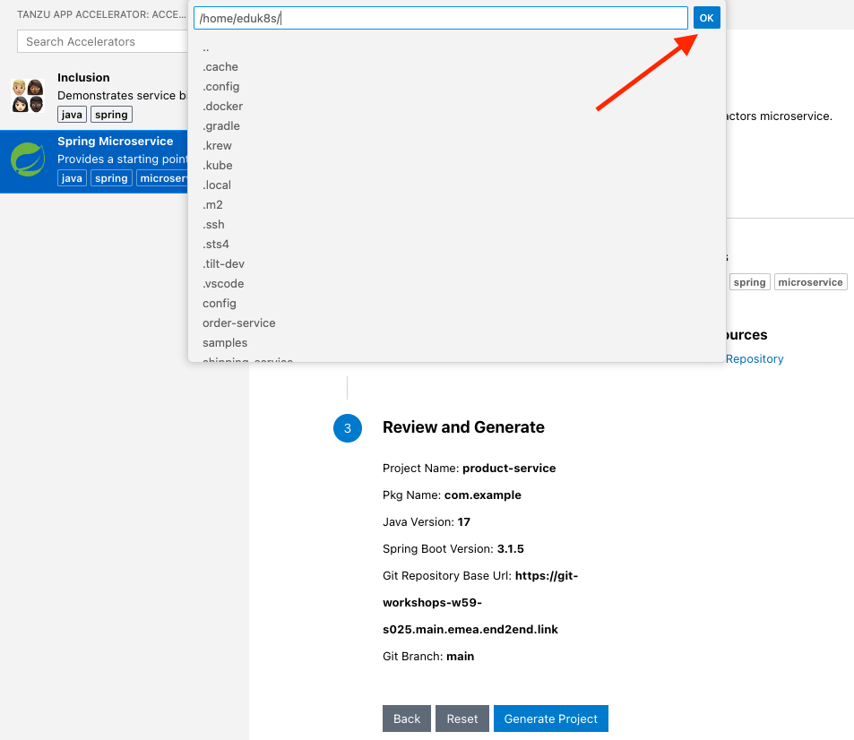

```examiner:execute-test
name: test-product-workload-file-exists
title: Verify that product service workload exists
delay: 5
retries: .INF
autostart: true
cascade: true
```
```terminal:execute
command: |2
  if ! grep -q gitops_ssh_secret "product-service/config/workload.yaml"; then
  cat <<EOL >> product-service/config/workload.yaml
  
    params:
    - name: gitops_ssh_secret
      value: git-https
    - name: registry
      value:
        server: $REGISTRY_HOST
        repository: workloads
  EOL
  fi
  clear
```

Before we have a closer look at the challenges of our typical microservice application, let's **implement** one of the services from scratch - in this case, the **product service**.

The easiest way to get started you're probably familiar with, is visiting [start.spring.io](https://start.spring.io), and selecting your Spring Boot version and the dependencies you want to use.

Inspired by the Spring Initializr, **Application Accelerators for VMware Tanzu** enables developers to create new applications based on templates implemented in any technology that follow enterprise standards of your organization. This accelerates how you go from idea to production with ready-made, enterprise-conformant code and configurations without needing to read tons of docs straight away.

By clicking on the below link, you will open the IDE plugin to see a list of accelerators available.
```editor:execute-command
command: workbench.view.extension.tanzu-app-accelerator
```

Select the **Spring Microservice** accelerator from the list, and change the following values in the form:
- **Project name:** 
```copy
product-service
```
- **Git base url:**
```copy
{{ git_protocol }}://{{ git_host}}
```
- **Deployment namespace:**
```copy
{{ session_namespace }}
```

- Press **Next Step**
- Press **Generate Project**. When you click on **Generate Project** there will be a popup window that opens at the top of the Editor with the path `/home/eduk8s/`, click **OK** to accept the defaults.



- The accelerator has now generated the code.  You will see a pop-up in the bottom right-hand corner of the IDE asking if you want to open the project in a new tab.  Click **No** to open the new project in the current window.


Let's start building out the product service.

Before adding any code, though, we'll have a look at what the accelerator created for us.

Lets start by looking at the dependencies of our app.

```editor:open-file
file: product-service/pom.xml
```
In the `pom.xml` file, you will see we are using Java 17, Spring Boot 3.1.2, Spring Cloud 2022.0.4, and also including the dependencies `spring-boot-starter-web`, `spring-boot-starter-actuator`, and `spring-boot-starter-security`.

The accelerator also generated a main `Application` class for us which we can use to run our application.

```editor:open-file
file: product-service/src/main/java/com/example/productservice/Application.java
```

It also generated another class called `ProductResource`.


```editor:open-file
file: product-service/src/main/java/com/example/productservice/product/ProductResource.java
```

`ProductResource` is a `RestController` with a single endpoint at `/api/v1/products` which returns `Hello World`.

We want to change this endpoint to return a list of products, so the first step is to create a way of representing a product in our application.

Click the command below to create a `Product` class.

```editor:append-lines-to-file
file: ~/product-service/src/main/java/com/example/productservice/product/Product.java
text: |2
  package com.example.productservice.product;

  public class Product {

      private Long id;
      private String name;

      private Product(Long id, String name) {
          this.id = id;
          this.name = name;
      }

      public static Product create(Long id, String name) {
          return new Product(id, name);
      }

      public Long getId() {
          return id;
      }

      public void setId(Long id) {
          this.id = id;
      }

      public String getName() {
          return name;
      }

      public void setName(String name) {
          this.name = name;
      }
  }
```

Next, we'll add an application service with the business logic to provide a list of products.  

Click the command below to add the `ProductApplicationService` class.

```editor:append-lines-to-file
file: ~/product-service/src/main/java/com/example/productservice/product/ProductApplicationService.java
text: |2
  package com.example.productservice.product;

  import org.slf4j.Logger;
  import org.slf4j.LoggerFactory;
  import org.springframework.beans.factory.annotation.Value;
  import org.springframework.stereotype.Service;

  import java.util.List;
  import java.util.stream.Collectors;

  @Service
  public class ProductApplicationService {

      private static final Logger log = LoggerFactory.getLogger(ProductApplicationService.class);

      @Value("${product-service.product-names}")
      private List<String> productNames;

      List<Product> fetchProducts() {
          log.info("Fetch products called");
          return productNames.stream()
                  .map(name -> Product.create((long) (productNames.indexOf(name) + 1), name))
                  .collect(Collectors.toList());
      }
  }
```

The `ProductApplicationService.fetchProducts` method returns a list of `Product`s created from the configuration property `product-service.product-names`.

Let's modify `ProductResource` to use the `ProductApplicationService` to provide the list of products when a
`GET` request is made to `/api/v1/products`.

```editor:insert-lines-before-line
file: ~/product-service/src/main/java/com/example/productservice/product/ProductResource.java
line: 5
text: "import java.util.List;"
```

```editor:insert-lines-before-line
file: ~/product-service/src/main/java/com/example/productservice/product/ProductResource.java
line: 11
text: |2
    private final ProductApplicationService productApplicationService;

    ProductResource(ProductApplicationService productApplicationService) {
        this.productApplicationService = productApplicationService;
    }
```

```editor:select-matching-text
file: ~/product-service/src/main/java/com/example/productservice/product/ProductResource.java
text: "Hello World"
before: 1
```
```editor:replace-text-selection
file: ~/product-service/src/main/java/com/example/productservice/product/ProductResource.java
text: |2
    public ResponseEntity<List<Product>> fetchProducts() {
        return ResponseEntity.ok(productApplicationService.fetchProducts());
```

The `ProductApplicationService` requires the property `product-service.product-names` to be set with a list of names.

```editor:select-matching-text
file: ~/product-service/src/main/java/com/example/productservice/product/ProductApplicationService.java
text: "@Value"
before: 1
```

So we've to add it to the `product-service/src/main/resources/application.yaml`.

```editor:append-lines-to-file
file: ~/product-service/src/main/resources/application.yaml
text: "product-service.product-names: VMware Tanzu Application Platform"
```
Since we also have an `application.yaml` in `product-service/src/test/resources` for testing purposes we also need to add it there.

```editor:append-lines-to-file
file: ~/product-service/src/test/resources/application.yaml
text: "product-service.product-names: VMware Tanzu Application Platform"
```

With the use of the Tanzu Developer Tools' **Live Update** extension, which is facilitated by [Tilt](https://tilt.dev), we can deploy our code to TAP once, save changes to the code, and see those changes reflected in the workload running on the cluster within seconds.

This will feel very familiar if you are using [Spring Developer Tools](https://docs.spring.io/spring-boot/docs/current/reference/html/using.html#using.devtools) locally.

The accelerator we used already created a `Tiltfile` for us, which instructs Tilt what to do.
```editor:open-file
file: product-service/Tiltfile
```

We can **start the TAP's live update functionality** via the **context menu item** `Tanzu: Live Update Start` **Or**, we can click on the command below to accomplish the same thing.
```editor:execute-command
command: tanzu.liveUpdateStart
```
**Accept the hint** that the `Namespace must be watched by Tanzu Workloads panel to perform actions`.

TAP will deploy the application using the source from our local file system. 

We can use `watch` in the terminal to see once our app is deployed in this case as a Knative Service, which you'll learn later more about.
```terminal:execute
session: 2
command: |
  watch -n 1 kubectl get service.serving.knative.dev product-service
```
The deployment has finished once the Knative service is marked `Ready`.


To validate that our REST API works, stop the `watch` command and execute the following `curl` request.
```terminal:interrupt
session: 2
```

```terminal:execute
session: 2
command: |
  curl -s https://product-service-{{ session_namespace }}.{{ ENV_TAP_INGRESS }}/api/v1/products | jq .
```

Let's test the Live Update functionality by adding an additional product to `product-service.product-name`.

```editor:select-matching-text
file: ~/product-service/src/main/resources/application.yaml
text: "product-service.product-names: VMware Tanzu Application Platform"
```
```editor:replace-text-selection
file: ~/product-service/src/main/resources/application.yaml
text: "product-service.product-names: VMware Tanzu Application Platform, VMware Spring Runtime"
```

Run `./mvnw compile` to make sure the app was recompiled to trigger the update in the container.
```terminal:execute
session: 2
command: |
  (cd product-service && ./mvnw compile)
```

By sending another request to the `product-service`, you should see the updated list of products.
```terminal:execute
session: 2
command: |
  curl -s https://product-service-{{ session_namespace }}.{{ ENV_TAP_INGRESS }}/api/v1/products | jq .
```
After the basic implementation of our product service, we will now configure a continuous path to production.

**Click the trash can button in the terminal pane to stop the Live Update process.**
When Live Update stops, your application continues to run on the cluster, but future changes in the editor will not be applied to it, unless you start the Live Update again.
```terminal:interrupt
```
