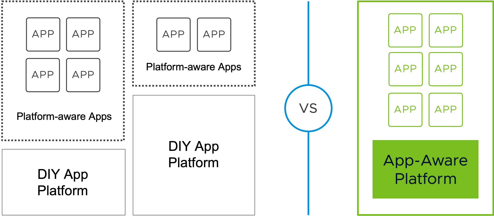

The picture shows a typical microservice application for a supply chain. 
- The **product service** only has one REST endpoint to fetch the list of products.
- With the **order service** REST API, clients are able to fetch the current orders that are stored in a MySQL database, and they are also able to create new orders. The product id for a new order is validated with the list of products that will be fetched from the product service via a synchronous REST call.
- After the order is created and stored in the database, information like the shipping address will be sent to the **shipping service** via asynchronous messaging, and after a configurable amount of time (for example 10 seconds), a status update for the DELIVERY will be sent back via asynchronous messaging to be consumed by the order microservice.

All the microservices are or will be implemented using the Spring Framework ecosystem.

#### Spring by VMware 

The goal of **Spring** is to simplify and accelerate application development, and due to its autoconfiguration, **Spring Boot** is the foundation for fast development of production-ready applications. 

**Spring Cloud** supports the development of microservice architectures by implementing proven patterns for example for resilience, reliability, and coordination.

With the help of Spring Boot and Cloud, it's possible to mitigate a lot of challenges of our typical microservice application, but regarding the deployment, there is for example still a high effort to manage the cloud infrastructure for the microservice, and the application lifecycle is difficult to manage. Platforms like our commercial Cloud Foundry offering VMware Tanzu Application Service, Azure Spring Apps Enterprise, and VMware Tanzu Application Platform take on the challenges.

#### VMware Tanzu Application Platform

**VMware Tanzu Application Platform** (informally known as TAP) provides development teams a **pre-paved path to production** to get code running on any compliant public cloud or on-premises Kubernetes cluster, enabling security and scale. It is **modular**, so you can customize it based on your organization’s preferences.

TAP is an **application-aware platform** that abstracts away all platform and infrastructure specifics 
and gives development teams an interface where they only have to define the requirements of the applications they want to run on the platform. 

**This interactive workshop aims to teach you how to mitigate the challenges of a typical microservice application with the Spring Framework ecosystem and capabilities of VMware Tanzu Application Platform!**